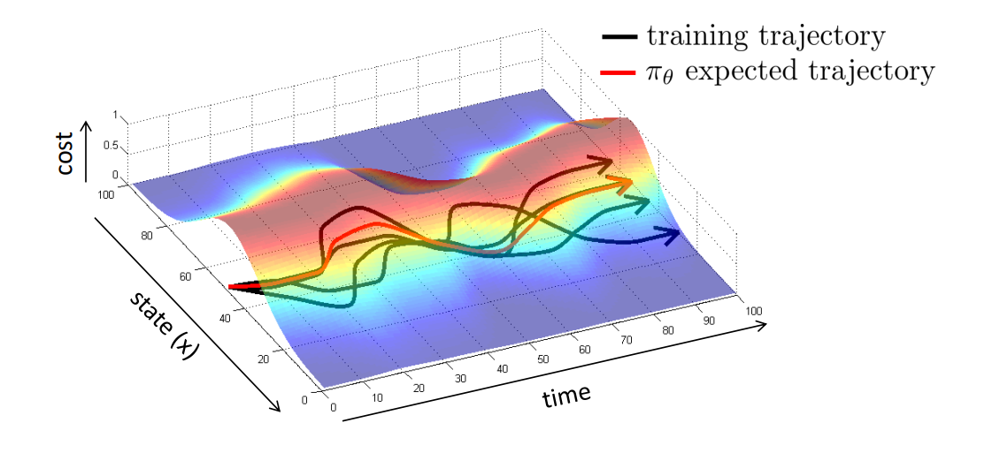
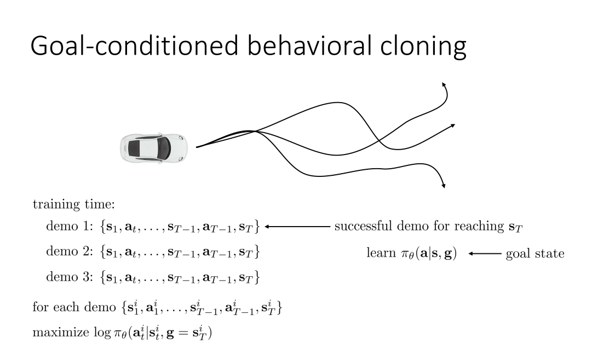
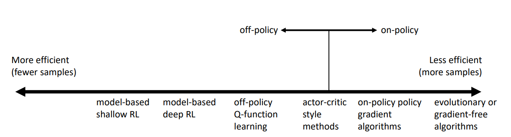
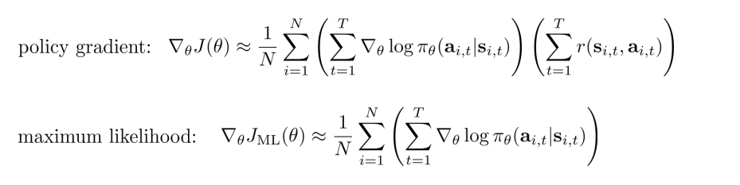
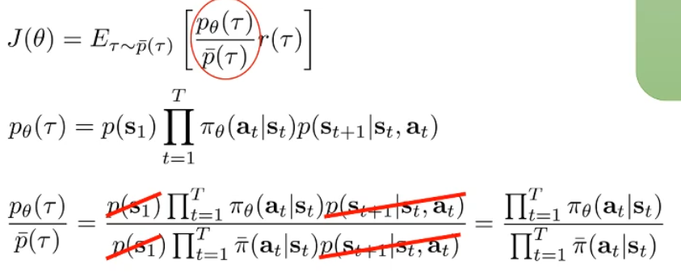
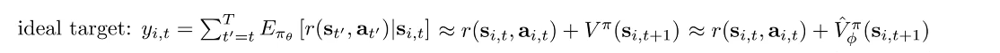
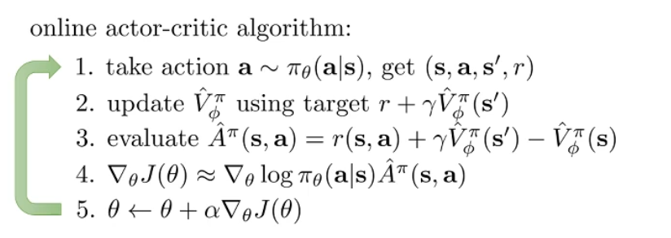

This is note for CS 285, DRL @ UCB.

Following http://rail.eecs.berkeley.edu/deeprlcourse-fa21/.

## Lec 2. Supervised Learning of Behaviors

首先引入一些记号。输入的 Observation 记为 $\mathbf o$（输入图像），输出的 Action 记为 $\mathbf a$（预测标签），而策略网络（Policy）记为 $\pi_\theta(\mathbf a \mid \mathbf o)$。我们使用下标 $t$ 来表示离散化之后的时间步，即 $\mathbf o_t$，$\mathbf a_t$ 和 $\pi_\theta(\mathbf a_t \mid \mathbf o_t)$。有时我们使用 $\mathbf s_t$ 来表示当前时间步的状态（State），$\mathbf s_t$ 和 $\mathbf o_t$ 的区别在于，(1) Observation 是观察到的现象，State 是由 Action 决定的反应系统状态的量；(2) 仅使用 Observation 可能没办法去推断 State，不同的 Observation 可能对应同一个 State；(3) 状态 State 往往是被认为满足马尔科夫性质的，而 Observation 却不是如此。也有的记号用 $\mathbf x_t$ 表示 State，$\mathbf u_t$ 表示 Action。

**Imitation Learning** 是一种学习 Policy 的方式。它也叫 **behavioral cloning**，即收集了大笔 $\mathbf o_t$ 和专家给出的 $\mathbf a_t$ 对作为训练数据，使用有监督学习的方式去进行学习。跟常见的有监督学习不同，这种方式通常来说是不工作的（除非训练数据照顾到足够多的 Corner Cases），这是因为 State 的误差会随着多次 Inference 的时间步累积，如下图所示：

**【解决方案 1：DAgger】** 想要解决上述的问题（Distributional drift Problem），解决思路 1 应该是尽可能减少因为误差累积导致的 State 偏差。一个可能的解决方案是从训练数据的角度出发，我们尽可能照顾到更多的情况，如下图所示：

也就是说，我们尝试去修改我们的训练数据 $p_\text{data} (\mathbf o_t)$。我们可以试着以 $p_{\pi_\theta} (\mathbf o_t)$ 作为训练状态，然后让人工标注在这个训练状态下需要什么样的 Action $\mathbf a_t$，然后使用当前的策略网络去进行推理，收集下一个需要标注的状态。这种方法叫做 DAgger（Dataset Aggregation）：

**【解决方案 2：更好地拟合专家】** 另一种解决方案是更好地去拟合专家给出的 Action 数据，减少单步产生的误差。这主要从以下两个方面着手：

- Observation 不满足马尔科夫性质：将 Policy 的 Formulation 从 $\pi_\theta(\mathbf a_t \mid \mathbf o_t)$ 改为 $\pi_\theta(\mathbf a_t \mid \mathbf o_t, \mathbf o_{t-1}, \cdots, \mathbf o_1)$，这通过采用一些具有记忆功能的网络结构来实现。
  - 这样做会一定程度上减轻 Causal Confusion 的问题（fixed-capacity policies that are trained to fixed training error on the same demonstrations with access to more information can actually yield worse performance）
- 从人类中学到的 Action 并不是唯一的：(1) 可以考虑输出 mixture of Gaussians 作为答案；(2) 可以考虑让策略网络输入 latent variable 作为输入，将 observation 作为 condition 对 random latent variable 进行 decode；(3) 自回归离散化 Autoregressive discretization，逐个输出维度进行离散化后，对 softmax 之后的结果采样，将采样得到的结果输入另一个网络中进行下一个输出维度的离散化和采样，如此迭代。

**【解决方案 3：更稳定的 trajectory】** 我们也可以让 trajectory 的性质更稳定（对微小误差有容忍度）来解决 Distributional drift 的问题，具体方案在后面的章节介绍。

小结：Imitation Learning 这种范式的固有问题就是需要人类专家来提供数据，而这往往是有限或者在表示方式上十分困难的。

**Cost functions，Reward functions** 的相关介绍。从一个具体例子出发，我们可以形式化表示我们的目标为：
$$
\min _\theta E_{\mathbf{a} \sim \pi_\theta(\mathbf{a} \mid \mathbf{s}), \mathbf{s}^{\prime} \sim p\left(\mathbf{s}^{\prime} \mid \mathbf{s}, \mathbf{a}\right)}\left[\delta\left(\mathbf{s}^{\prime}=\text { eaten by tiger }\right)\right] \\
\Rightarrow \min _\theta E_{\mathbf{s}_{1: T}, \mathbf{a}_{1: T}}\left[\sum_t \delta\left(\mathbf{s}_t=\text { eaten by tiger }\right)\right] \\
\Rightarrow  \min _\theta E_{\mathbf{s}_{1: T}, \mathbf{a}_{1: T}}\left[\sum_t c\left(\mathbf{s}_t, \mathbf{a}_t\right)\right] (*)
$$
这里 $c(\mathbf s_t, \mathbf a_t)$ 就是 cost function，或者我们将 min 改成 max 就是 reward function $r$。

**Goal-conditioned Policies.** 我们将最终的 Goal State 也作为 Policy Network 的输入。通过仿真环境采集足够多的数据，并筛选到达某个最终 Goal 的数据出来进行 Retrai

## Lec 4. Introduction to Reinforcement Learning

### Notations

**Markov Decision Process** (MDP)

$r$ : $\mathcal S \times \mathcal A \rightarrow \mathbb R$, 是 reward function.

**Partially-observed MDP**

**【强化学习的 Objective】** 由于 Markov 性质，我们可以将强化学习的目标写成：
$$
\begin{gathered}
\underbrace{p_\theta\left(\mathbf{s}_1, \mathbf{a}_1, \ldots, \mathbf{s}_T, \mathbf{a}_T\right)}_{p_\theta(\tau)}=p\left(\mathbf{s}_1\right) \prod_{t=1}^T \pi_\theta\left(\mathbf{a}_t \mid \mathbf{s}_t\right) p\left(\mathbf{s}_{t+1} \mid \mathbf{s}_t, \mathbf{a}_t\right) \\
\\
\theta^{\star} =\arg \max _\theta E_{\tau \sim p_\theta(\tau)}\left[\sum_t r\left(\mathbf{s}_t, \mathbf{a}_t\right)\right] \\
=\arg \max _\theta \sum_{t=1}^T E_{\left(\mathbf{s}_t, \mathbf{a}_t\right) \sim p_\theta\left(\mathbf{s}_t, \mathbf{a}_t\right)}\left[r\left(\mathbf{s}_t, \mathbf{a}_t\right)\right]

\end{gathered}
$$
这里 $\tau$ 表示整个 trajectory，$p_\theta\left(\mathbf{s}_t, \mathbf{a}_t\right)$ 是 state-action marginal distribution。

当我们考虑无穷步的时候，由于 $p_\theta\left(\mathbf{s}_t, \mathbf{a}_t\right)$ 最终会收敛成静态分布 $p_\theta\left(\mathbf{s}, \mathbf{a}\right)$，我们可以将强化学习的目标写成：
$$
\theta^{\star}=\arg \max _\theta \frac{1}{T} \sum_{t=1}^T E_{\left(\mathbf{s}_t, \mathbf{a}_t\right) \sim p_\theta\left(\mathbf{s}_t, \mathbf{a}_t\right)}\left[r\left(\mathbf{s}_t, \mathbf{a}_t\right)\right] \rightarrow E_{(\mathbf{s}, \mathbf{a}) \sim p_\theta(\mathbf{s}, \mathbf{a})}[r(\mathbf{s}, \mathbf{a})]
$$

### Value Functions 

### Algorithms

The anatomy of a RL Algo. is a loop of following three steps:

- Generate Samples (i.e. run the policy)
- Fit a model, and then estimate the return
- Improve the policy

在考虑 sample efficiency 时，off policy 是说 sample 与 policy 无关，on policy 是说如果 policy 修改，就需要生成新的 sample。

## Lec 5. Policy Gradients

我们考虑对 Objective 进行求梯度。
$$
\begin{aligned}
&\theta^{\star}=\arg \max _\theta \underbrace{E_{\tau \sim p_\theta(\tau)}\left[\sum_t r\left(\mathbf{s}_t, \mathbf{a}_t\right)\right]}_{J(\theta)}\\
&\begin{gathered}
J(\theta)=E_{\tau \sim p_\theta(\tau)}[r(\tau)]=\int p_\theta(\tau) r(\tau) d \tau \\
\end{gathered}
\end{aligned}
$$
进行简单的代换，我们有：

由于：
$$
\log p_\theta(\tau)=\log p\left(\mathbf{s}_1\right)+\sum_{t=1}^T \left( \log \pi_\theta\left(\mathbf{a}_t \mid \mathbf{s}_t\right)+\log p\left(\mathbf{s}_{t+1} \mid \mathbf{s}_t, \mathbf{a}_t\right)\right)
$$
而且：
$$
\nabla_\theta\log p\left(\mathbf{s}_1\right) = 0, \\
\nabla_\theta\log p\left(\mathbf{s}_{t+1} \mid \mathbf{s}_t, \mathbf{a}_t\right) = 0,
$$
于是：
$$
\nabla_\theta J(\theta)=E_{\tau \sim p_\theta(\tau)}\left[\left(\sum_{t=1}^T \nabla_\theta \log \pi_\theta\left(\mathbf{a}_t \mid \mathbf{s}_t\right)\right)\left(\sum_{t=1}^T r\left(\mathbf{s}_t, \mathbf{a}_t\right)\right)\right]
$$
然后我们可以用采样 N 个小样本作为一个 Batch 的方法来对期望值进行估计。

这个 formulation 在 partially observed (no states but observations) 的情况下也适用。

Policy gradient 的方法也有一定的问题。比如在下图所示，

这是 Policy gradient 方法存在的 **High Variance** 问题。具体来说，上述两幅图的有颜色的线段代表 sample，bar 代表 reward 的大小，横轴表示 trajectory，蓝色的线表示在某个 Policy 下的 possibility distribution。上下两幅图的区别是给 reward function 加了一个常量，而这导致这次对策略的更新变得十分不稳定。如果采到的数据集足够大这个问题自然可以缓解，但在有限数据集下这个问题仍然存在。

This problem can be identified as follows. Without any a prior model of the system we're seeking to optimize, we begin with a policy whose distribution of actions over a given state is effectively uniform. Of course, as we train the model we hope to shape the probability density so that it's unimodal on a single action, or possibly multimodal over a few successful actions that can be taken in that state. However, acquiring this knowledge requires our model to observe the outcomes of many different actions taken in many different states. This is made exponentially worse in continuous action or state spaces as visiting even close to every state-action pair is computationally intractable. 

**Variance Reduction** 的有关方法。这里首先介绍 **reward to go** 方法。这个方法基于 causality，即当 $t \lt t'$ 时，在 $t$ 时刻获得的 reward 不会被 $t'$ 时刻做出的策略影响，即现在的策略的更新方向不应该与过去的 reward 有关，这也就是说，我们可以将 policy gradient 的 formulation 修改为：
$$
\nabla_\theta J(\theta) \approx \frac{1}{N} \sum_{i=1}^N \sum_{t=1}^T \nabla_\theta \log \pi_\theta\left(\mathbf{a}_{i, t} \mid \mathbf{s}_{i, t}\right) \underbrace{(\sum_{t'=t}^T r\left(\mathbf{s}_{i, t^{\prime}}, \mathbf{a}_{i, t^{\prime}}\right)}_{\begin{array}{c}
\text { "reward to go" } \\
\hat{Q}_{i, t}
\end{array}})
$$

然后是 **Baseline** 方法，这个方法的 intuition 非常简单，即我们让比平均更好的 policy 的 reward 是正数，不然 reward 是负数，我们只需要简单修改：

方法的正确性可以被证明，即使从 reward function 中减去了一项，对于 policy gradient 的期望估计仍然是无偏的、同时，我们还可以通过对 policy gradient 的方差对 b 求偏导的方式，derive 出可以使 policy gradient 方差最小的 b 值。

**Off-policy Policy Gradients.** 上述的 Policy Gradients 方法是经典的 On-policy 方法，因为每次对 Policy Network 进行更新后，都要重新采样数据，因为 underlying distribution of trajectories 发生了改变，而我们在估计 $\nabla_\theta J(\theta)$ 时需要在 $E_{\tau \sim p_\theta(\tau)}$ 的设定下采样。这里我们尝试解决如果我们没有从 $p_\theta(\tau)$ 从采样的数据，而只有从另一个分布 $\bar{p}(\tau)$ 中采样的数据的问题。这里的解决方法叫做 **Importance Sampling**. 

这样我们可以从某个时刻的 Policy 中采样一些数据，然后用来优化另一个时间步的 Policy：

我们可以再将 causality 的考量加进去，这样得到 Off-policy 的 Policy Gradients 算法的新版本：

但是，最后一项（从 t''=t 到 t''=t'）Importance Weight 往往因为是多个 <1 的数相乘而变得很小，在实际运用时往往忽略本项，即使忽略也不影响正确性，会得到一个 Policy Iteration 算法。

同时，Policy gradient 还有一些其他的数值上的问题。比如下面这个例子：

我们可知这时最优的 $\theta$ 在 $k=-1, \sigma \rightarrow 0$ 时取得。但是我们可以看到右图中，policy gradient 的方向并不总是指向 optimal solution，这时因为在 $\sigma \rightarrow 0$ 时，由于导数的数值精度问题，大部分精力用于优化 $\sigma$ 上。从数值分析的角度，这是只考虑了一阶导数所导致的。

下面是解决这个问题的方法，我们考虑一次优化的过程。我们现在是在 Parameter Space 搜索，使得在一个 Step 变化不超过 $\epsilon$ 的前提下，寻找可以最大化 reward value 的方式。而这样做是有问题的，因为有些参数的 gradient 相对于其他参数的 gradient 来说在数值意义上更加 bad-conditioned。于是取而代之的，我们不在参数空间考虑，而是在 Policy space 上考虑，寻找一个在 Policy 变化不大的情况下的优化 Step，其中 Policy 的变化用类似于 KL 散度的 divergence 度量来衡量。这里，我们用 KL 散度的二阶近似，展开结果如下图所示。

这里可以将结果写成：

c.f. Trust Region Policy Optimization.

## Lec 6. Actor-Critic Algorithms

Actor-Critic 算法基于 Policy Gradients 算法的基础上改进，将表示 reward to go 的 Q 函数与表示状态价值的 V 函数视为可学习的，这样做是为了减少只 sample 一条或几条 trajectory 去估计 Q 和 V 时的误差：

我们这里给出 Advantage Function $A^\pi(\mathbf s_t, \mathbf a_t)$ 的定义如下：

有了这些函数的定义后，我们首先决定要去拟合其中的哪些函数。我们首先可以近似地将 Q 和 A 表示成 V：

**Policy Evaluation.** 我们接下来关注拟合 $V^\pi$ 函数的过程，这个过程也被叫做 Policy Evaluation。比较 Naive 的拟合方法是使用 Monte Carlo evaluation，即每次都将仿真器的状态 reset 回 $\mathbf s_t$，然后 rollout 多次取 reward 的平均值。我们可以进一步优化这个 rollout 的过程，一般叫做 bootstrapped estimate，将考虑拟合的 V 函数 target 近似如下：

**Discount Factors.** 使用 bootstrapped estimate 去做 policy evaluation 时，如果是对于 episodic 的任务可能没有很大问题，但如果是对于 infinite horizon 的任务，如果每一步都用估计的 V 值的话，可能最终会 accumulate 到正无穷。解决的方法是用下图所示的 simple trick, where $\gamma \lt 1$：

我们可以根据以上分析导出 online 的 Actor-Critic 算法：

