## 计算机系统结构基本概念

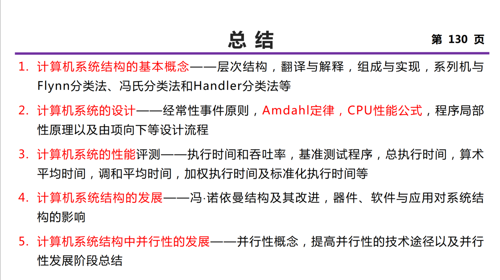

提高并行性的技术途径：时间重叠 资源重复 资源共享

程序执行的极大值影响算术平均值，极小值影响调和平均值。

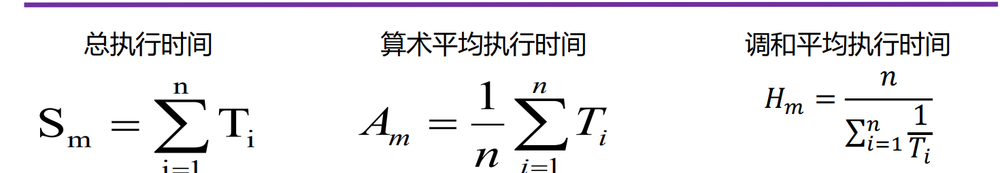

## 指令系统的设计

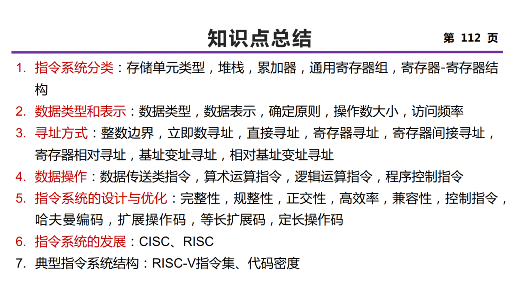

区别不同指令系统的主要因素： CPU用来存储操作数的存储单元类型

表示操作数类型 / 寻址方式：① 编码到操作码中 ② 设置额外字段（硬件标识 / 地址描述符）

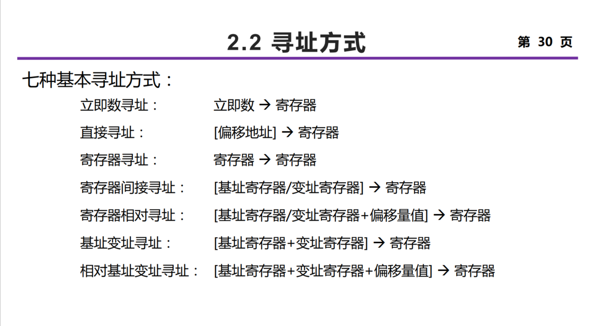

## 流水线技术

定位方式：直接定位方式（装入主存之前）、静态定位（装入主存时）、动态定位（执行过程中）

时空图（横轴、纵轴），通过时间，排空时间，T=(n+k-1)t

连接图（输入->流水段1->流水寄存器->流水段2->流水寄存器->输出）

静态与动态流水线都是多功能流水线，分类标准为在同一时间内，多功能流水线中的各段是否可以按照不同的方式连接，同时执行多种功能。

**吞吐率**：单位时间内流水线完成的任务数量，TP = n个任务/完成n个任务的时间T。

解决瓶颈问题：细分瓶颈段，或者重复设置瓶颈段

**加速比**：完成同样一批任务，不使用流水线所用的时间与使用流水线所用的时间之比。表面上看流水线级数越多越好。

**效率**：是指流水线的设备利用率。在时空图上，流水线的效率定义为n个任务占用的时空区与m个功能段总的时空区之比。

*做分析题的时候（Slides 两道例题）注意是静态流水还是动态流水线。*

---

线性与非线性流水线：根据流水线中是否存在反馈回路。前者可以被连接图唯一表示，后者需要被连接图和预约表共同表示。**单功能非线性流水线的调度**：预约表横向（向右）是时间（一般用时钟周期表示），纵向（向下）是流水线的段；引起非线性流水线冲突的启动距离称为**禁止启动距离**。向一条非线性流水线的输入端顺序输入两个任务之间的时间间隔称为启动距离/等待时间。 不发生冲突的启动距离一般是一个循环数列，称为非线性流水线的**启动循环**，记作（1，7）。 启动距离5也可以认为是一个循环数列，称为非线性流水线的**恒定循环**，记作（5）。  流水线调度目的：**找出一个最小启动循环，按照这周期向流水线输入新任务，流水线的各个功能段都不会发生冲突，而且流水线的吞吐率和效率最高**。  

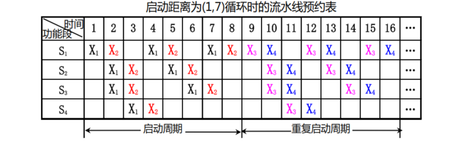

下面是**单功能非线性流水线调度算法**。

①由预约表得到**禁止集合**（将预约表中的每一行中任意两个“×”之间的距离都计算出来，去掉重复的，由这些数形成禁止集合 ，如 {2,4,6}） 

② 由禁止集合得到冲突向量 （冲突向量用一个m位的二进制数表示（其中m是禁止向量中的最大值），一般格式为 C=CmCm-1…Ci…C2C1）

③ 由冲突向量构造调度流水线的状态图（将冲突向量C作为初始冲突向量送入一
个m位逻辑右移移位器，移位m次；n **若移出的是“0”，用移位器中的值与初始冲突向量作“按位或”运算，得到一个新的冲突向量；n 若移出的是“1”，不作任何处理**。将中间形成的每一个新的冲突向量同样处理；画出状态图）

④ 在状态图中找出可用启动距离，并计算平均启动距离。（在状态图中从初始状态出发，能构成一种间隔拍数呈周期性重复的方案就是可用启动距离  ）

⑤找出平均启动距离最小的启动循环或恒定循环

流水线**最小平均启动距离**的限制范围：① 下限是预约表中任意一行里“×”的最多个数（理想最小平均启动距离）。理想最小启动循环：一般恒定循环作为最小启动循环。 最小平均启动距离的上限是冲突向量中1的个数再加上1 。

采用预留算法来调度非线性流水线，可以达到最优调度。核心思想：通过插入非计算延迟段——修改预约表实现最小启动循环。（每一行中与第1个“×”的距离为2的倍数的位置都要预留出来。）

---

指令相关：两条指令之间存在某种依赖关系。分为：数据相关（真数据相关，RAW）、名相关（反相关 WAR，输出相关 WAW）、控制相关。

流水线冲突：结构冲突（Stall+Bubble），数据冲突（bypassing 定向技术，编译器调度），控制冲突（3种通过软件（编译器）来减少分支延迟的方法：对分支的处理方法在程序的执行过程中始终是不变的，是静态的，保证分支结果出来之前不能改变处理机的状态。①预测分支失败  ②预测分支成功 ③ 延迟分支  ）

流水线最佳段数的选择：平衡流水线深度与造价。PCR=最大吞吐量 / 流水线价格，求极大值点。

## 数据级并行 向量处理机

向量平衡点：为了使向量硬件设备和标量硬件设备利用率相等，一个程序中向量代码所占的百分比（向量代码:标量代码运算速度比？）。

**存储器-存储器型结构**：纵向处理方式采用，利用几个**独立的存储器模块**来支持向对独立的数据**并发**访问。解决数据访问冲突：① 将存储器个数选为质数且大于等于向量长度 ② 在运算流水线的输入端和输出端增加可变缓冲器。

**寄存器-寄存器型结构**：分组处理方式采用，构造一个具有所要求带宽的高速寄存器，实现高速寄存器与主寄存器之间的快速数据交换。

CRAY-1 向量处理冲突：并行工作的各向量指令的源向量或结果向量使用了相同的Vi，或并行工作的各向量指令要使用同一个功能部件。

下面是一些提高向量处理机性能的常用技术。① 设置多个功能部件. ② 向量流水线冲突分析：指令不相关时可以并行执行，功能部件冲突、源寄存器冲突、结果寄存器冲突都需要避免。③ 向量流水线**链接技术**（具有**先写后读**相关的两条指令，在**不出现功能部件冲突和源向量冲突**的情况下，可以把功能部件链接起来进行流水处理，结果寄存器可作为后继指令的操作数寄存器）。

④ 分段开采技术：当向量的长度大于向量寄存器的长度时，必须把长向量分成长度固定的段，然后循环分段处理，每一次循环只处理一个向量段。先处理余数部分，然后对剩下的部分分组处理。

⑤ 向量的条件执行：可以使用屏蔽向量的方式来完成条件执行。

下面介绍**衡量向量处理机性能的主要参数**：

① 向量指令的处理时间 Tvp。如果不考虑Ts，定义启动时间 Tstart = Tvf - 1。

进而我们考虑**一组**向量指令的处理时间。把能在同一个时钟周期内一起开始执行的几条向量指令称为一个**编队**。同一个编队中的向量指令之间一定不存在流水向量功能部件的冲突和数据的冲突。编队后，这个向量指令序列的总的执行时间为各编队的执行时间的和。编队时考虑：无冲突，如果可链接则链接。

编队后，单个编队的启动时间为编队内所有指令的启动时间的最大值，记为 $T^{i}_{\text{start}}$。所有编队的总运行时间为 $\sum_i T^{i}_{\text{start}} + m n$，这里 m 表示 m 个编队，n 是向量长度。

然后，我们再进一步考虑支持分段开采下的一组向量指令的处理时间。设 n = p * MVL + q，这里 MVL 为向量寄存器长度，p 为商 q 为余数，由于我们需要对分段开采时引入额外的处理操作，我们假设这个额外的处理时间为 Tloop。于是余数处理的时间为：

② 最大性能 $R_{\infin}$。表示当向量长度为无穷大时，向量处理机的最高性能，也称为峰值性能.

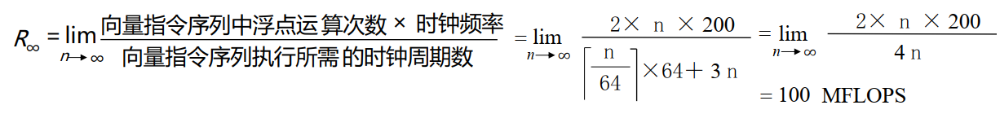

③ 半性能向量长度 $n_{1/2}$。半性能向量长度是指向量处理机的性能为其最大性能的一半时所需的向量长度，评价向量流水线的建立时间对性能影响。

④ 向量长度临界值 $n_v$。对于某一计算任务而言，向量方式的处理速度优于标量串行方式处理速度时所需的最小向量长度。

## 降低指令延迟 存储系统

先注意一手每条指令 1+m 次存储器访问，其中 m 是给 L/S 指令的。

**性能参数**：① 命中率 H = N1 / (N1 + N2)。平均访问时间 T = H x T1 + (1-H) x T2。② 访问效率 e = T1 / (H * T1 + (1-H) * T2) ；提升效率的方法：提高命中率 H，降低阶差 T2/T1。③ 缺失开销 $T_M = T_2 + T_B$，从下层访存时间 + 数据传输时间。$T_A = T_1 + (1-H) T_M$.

Cache 所要研究的内容：**映像规则，查找算法，替换算法，写策略**

**Cache 的性能分析**
$$
T_\text{CPU} = \text{IC} \times (\text{CPI}_\text{exec.} + 每条指令的平均访存次数 \times (1-H) \times T_M) \times T_\text{cycle}
$$
Cache 对于低 CPI、高时钟频率的 CPU 来说更加重要。

从 $T_A = T_1 + (1-H) T_M$ 分析可知，提高 Cache 性能可以 (a) 降低缺失率 (b) 减少缺失开销 (c) 减少命中时间。

三种缺失类型：强制性缺失（大的 Cache block）、容量缺失、冲突缺失（Higher associativity）。

容量为 N 的直接映象 Cache 的缺失率和容量为 N/2 的两路组相联Cache的缺失率差不多相同。

使用两级 Cache：减少缺失开销

+ 平均访存时间 ＝ 命中时间L1＋缺失率L1×（命中时间L2＋缺失率L2×缺失开销L2）  
+ 局部缺失率＝该级Cache的缺失次数/到达该级Cache的访问次数
+ 全局缺失率＝该级Cache的缺失次数/CPU发出的访存的总次数
+ 每条指令的平均访存停顿时间＝ 每条指令的平均缺失次数L1×命中时间L2＋每条指令的平均缺失次数L2×缺失开销L

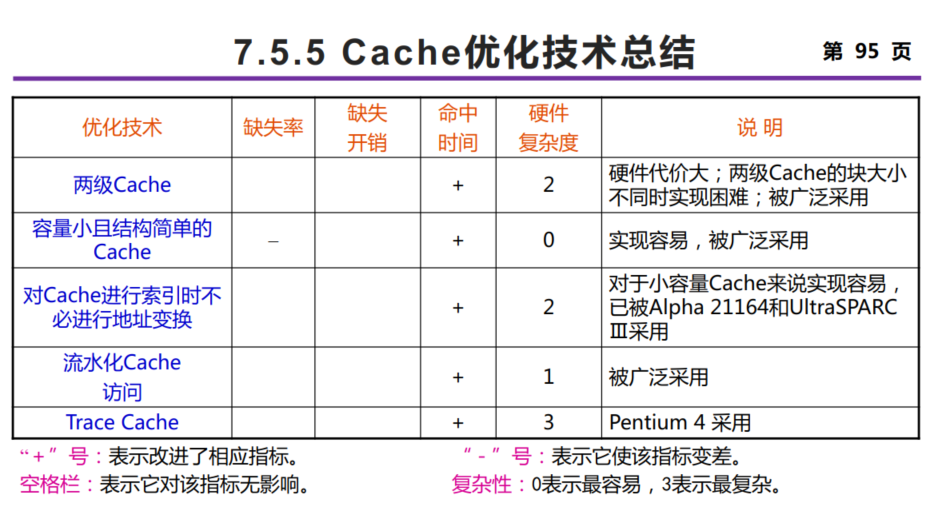

然后是如何编写 Cache 友好的代码，缺失率分析，交换顺序，分组。

## 指令级并行 硬件方法

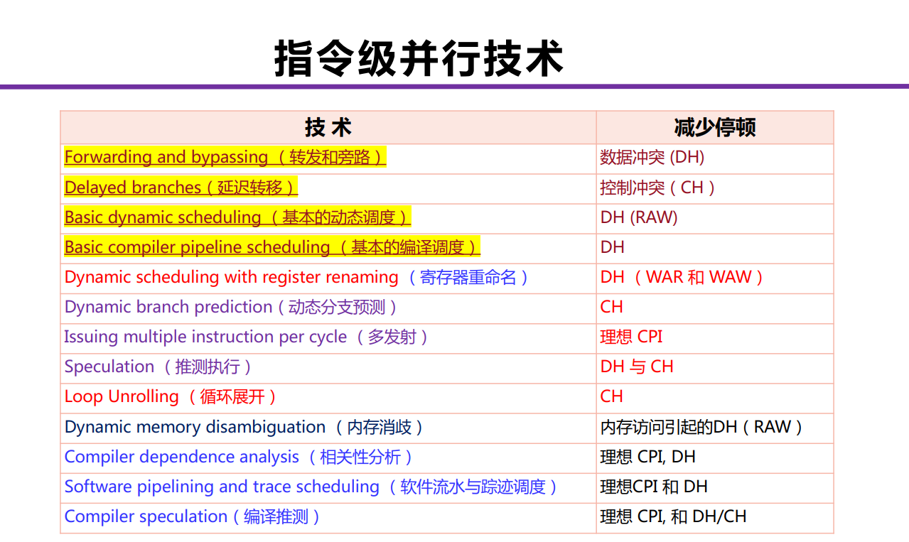

指令集并行的硬件方法或者软件方法都是围绕着提升理想 CPI、解决数据冲突与控制冲突这些事情而展开的。

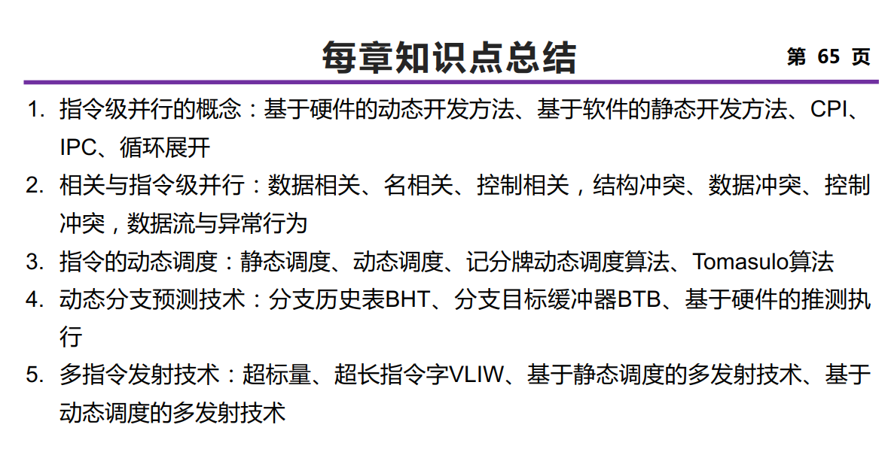

代码变换与指令调度必须保持的两个关键属性：数据流和异常行为不变

动态调度中，将译码阶段分成**发射**（检测结构冲突）和**读操作数**（检测数据冲突）两个阶段。进入动态调度后，会存在 WAW 和 WAR 相关的问题。同时，动态调度还需要考虑异常是否精确的问题。下面介绍两种动态调度算法：

① **记分牌调度算法。**我们需要维护三张表：**指令执行状态表，功能部件状态表，<u>结果</u>寄存器状态表**。

下面是算法的流程：

+ 发射阶段。当 功能部件可用 且 不存在 WAW 冲突 时可以发射。发射需要修改指令状态表的单元格，部件状态表的一整行（Rj Rk 表示是否 ready，如果不 ready 需要在 Qj Qk 填写等待的功能部件的名字，Fi 表示目的寄存器）和结果寄存器的单元格（填写部件名字）
+ 读操作数阶段。当 两个操作数都已经就绪（Rj == yes & Rk == yes）时读取。修改操作数就绪状态为 no，并且清空对应的 Qj 和 Qk。（只修改功能部件状态表）
+ 执行阶段。等待功能部件执行结束。
+ 写结果阶段。当 不存在 WAR 冲突（对于其它功能部件中的指令，Rj/Rk 为 yes，且 Fj/Fk 为待写入的 Fi） 时可以进入。此时需要清空结果寄存器状态表中结果寄存器和功能部件的对应关系，清除功能部件状态表中的对应行（将 Busy 置为 no），并通过广播将等待该功能部件结果的结果就绪状态 Rj/Rk 设为 yes（检查功能部件表的其他行，将 Qj/Qk 为本部件的 Rj/Rk 设置为 yes）

我们还可以通过寄存器重命名的方式来解决 WAR 相关和 WAW 相关，引入显式动态寄存器重命名机制，设置 ARF 和 PRF 并维护它们之间的映射表，这就有了**显式动态寄存器重命名的记分牌调度算法**（修改结果寄存器状态表为 ARF - PRF 映射表）。

② **Tomasulo 调度算法。**我们首先介绍一些这个调度算法引入的硬件架构：

(a) **保留站**。每个保留站中保存<u>若干</u>条已经发射并等待到本功能部件执行的指令的相关信息。在一条指令发射到保留站的时候，如果该指令的源操作数已经在寄存器中就绪，则将之取到该保留站中。如果操作数还没有计算出来，则在该保留站中记录将产生这个操作数的保留站的标识（功能部件）。我们引入公共数据总线（CDB）来承接所有功能部件的计算结果，由这条总线将结果广播到所有等待操作数的保留站中。

(b) **Load/Store 缓冲器**。Load 缓冲器记录有效地址分量、正在进行的 Load 访存地址和已经完成的 Load 结果等待广播；Store 缓冲器记录有效地址分量、正在进行的 Store 目标地址，保存地址和数据直到存储部件接收。

在 Tomasulo 算法中，寄存器换名是通过保留站和发射逻辑共同完成。当指令发射时，如果其操作数还没有计算出来，则将该指令中相应的寄存器号换名为将**产生这个操作数的保留站的标识**（使用一个寄存器状态表来记录某个寄存器是否正在等待被某个执行部件写），不然直接换成**数据本身**，和寄存器脱离了关系，因此称为**隐式寄存器重命名**。这使得 Tomasulo 算法的冲突检测和指令执行控制是分布的。

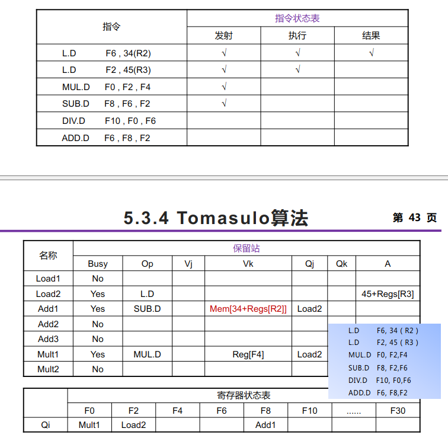

我们再详细展开一下 Tomasulo 调度算法的过程与上面的记分牌算法作对比。我们共有三个阶段：

+ **发射**阶段。指令在 有空闲保留站 时可以发射。修改指令状态表、保留站记录行（如果值 Ready 直接放入 Vj / Vk，不然在 Qj / Qk 中记录功能部件名）、目标寄存器状态表。对于 Load 和 Store 指令，将保留站的 A 字段设置为偏移立即数。
+ **执行**阶段。如果 Qj / Qk 均为空，则可进入执行阶段。Load / Store 命令除了这个条件之外，还需要在处于缓冲队列头部时才进入执行阶段，将 A 此时替换成有效地址。
+ **写回**阶段。将结果广播到 CDB ，进而影响 *(a)* 所有的保留站，对任意 Qj / Qk 为当前 FU，将 Qj / Qk 置空并将结果填入到 Vj / Vk *(b)* 目标寄存器，将值写入目标寄存器并释放目标寄存器状态表的表项 *(c)* 释放当前保留站的该指令记录项。

由于这两种动态调度方式都是顺序发射，乱序执行，乱序提交，很难实现精确异常。因此我们再引入 ROB 设计以允许顺序提交的出现。

我们用 ROB 表来替换指令运行状态表。注意这里原来在保留站中记录的部件名，在寄存器结果状态中记录的部件名全都换成了 ROB_IDX。

## 指令级并行 软件方法

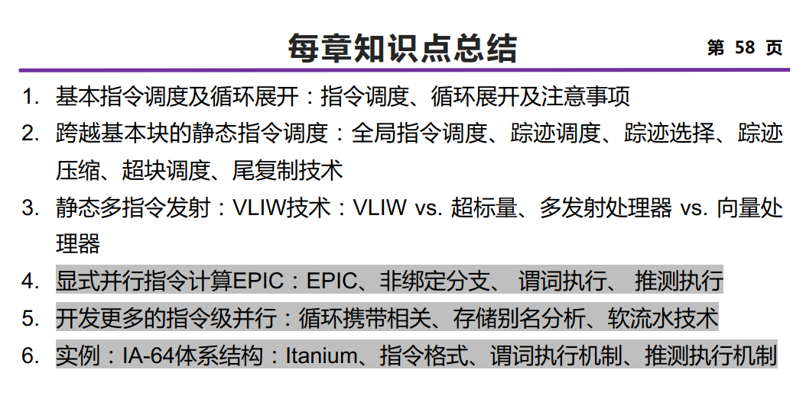

基本的指令调度：使用 delay slot，调换指令顺序，注意修改偏移量

上述基本的指令调度不能跨越基本块（分支指令），不能提升有效操作（非控制循环和解决数据相关等待用）比例，因此我们采取**循环展开**的方式。这是开发循环级并行的有效方法，具体来说，我们**把循环体的代码复制多次并按顺序排放，然后进一步消除名相关，进而调整循环的结束条件**。

全局展开：① 注意原来 else 分支的数据相关 ② 将分支汇总的指令可以复制两份到两个不同分支中，然后删除原来的指令；或是调度到分支之前

**静态多指令流出：VLIW技术**，把同时流出的或者满足特定约束的一组操作打包在一起，得到一条更长的指令。在VLIW处理器中，相关检测和指令调度工作全部由编译器完成。

## 互连网络

**互连网络**：**开关元件**按一定**拓扑结构**和**控制方式**构成的网络以实现计算机系统内部多个处理机或多个功能部件间的相互连接。三大要素：互连结构、开关元件、控制方式。

**互连函数**（置换函数或排列函数）通过数学表达式建立输入端号与输出端号的连接关系，即在互连函数f的作用下，输入端x连接到输出端f(x)。用 $n =\log_2N$ 位二进制来表示N个输入端和输出端的二进制地址。

介绍几种常用的基本互连函数及其主要特征。

① 恒等函数 $I(x_3x_2x_1x_0) = x_3x_2x_1x_0$. 

② 交换函数 $\text{Cube}_1 (x_2x_1x_0) = x_2 \overline x_1 x_0$. 

③ 均匀洗牌函数 $\sigma$。即把输入端的二进制编号**循环左移**一位。超函数和子函数分别用 $\sigma^{(k)}$ 和 $\sigma_{(k)}$ 表示，表示对高 $k$ 位或者低 $k$ 位做一次循环左移。逆均匀洗牌函数 $\sigma^{-1}$。

② 与 ③ 可以组成混洗交换函数。

④ 蝶式函数 $\beta$。把输入端的二进制编号的最高位与最低位互换位置。超函数与子函数。

⑤ 反位序函数 $\rho$​。将输入端二进制编号的位序颠倒过来求得相应输出端的编号。

⑥ 移数函数 $\alpha_{±k}(x) = (x ± k) \mod N$.

⑦ PM2I 函数。$\text{PM2}_{±i} = (x ± 2^i ) \mod N$.

互连网络的结构参数：网络规模（网络中结点的个数）N，结点度 d，结点距离（两个结点间距离的最小值）、网络直径 D（最大结点距离）、等分宽度 b。

评估互连网络性能的两个基本指标：时延和带宽。

互连网络通常可以分为两大类：① 静态互连网络（各结点之间有固定的连接通路、且在运行中不能改变的网络） ② 动态互连网络（由交换开关构成、可按运行程序的要求动态地改变连接状态的网络）。

下面介绍几种**静态互连网络**：

① 线性阵列：端节点 d=1，其余结点 d=2，直径 D=N-1，等分宽度 b=1

② 环：d=2，b=2, 单向环 D=N，双向环 D=N/2。带弦环，度为 k 就隔 k 个位置。全连接：d=N-1，D=1。

③ 循环移数网络：一般地，如果 $| j-i|=2^r, r= 0,1,\cdots, \log_2 N$，则结点i与结点j连接。这里结点度 d = 2n -1，直径 D=n/2，网络规模 $N=2^n$

⑥ 网格形：一个由 $N=n^k$ 个结点构成的 $k$ 维网格形网络（每维 $n$ 个结点）的内部结点度 $d=2k$，网络直径 $D=k(n-1)$；如果 k =2，则平面网格 d=4, D=2n-2, b=n。规模为n×n的Illiac网络：d=4, D=n-1, b=2n。环网形：d=4, D=2*floor(n/2), b=2n.

⑦ 超立方体：n-立方体中结点的度都是n，直径也是n，等分宽度为 $b=2^{n-1}$.   

**动态互连网络**：总线网络、交叉开关网络、多级互联网络（n输入 x n输出的开关，合法状态 $n \times n$ 个，置换连接 $n!$ 种）

多级立方体网络 N 输入，有 $\log_2 N$ 级别，每级有 N/2 个 2x2 开关，需要 $\log_2 N \times N /2$ 个 2x2 开关。STARAN 网络 / Omega 网络，(a) 4 组 2 元交换 (b) 2 组 4 元交换 (c) 1 组 8 元交换.

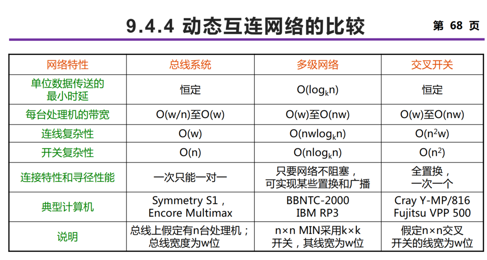

消息传递机制：当源结点和目的结点之间没有直接的连接时，消息需要经过中间的结点进行传递；寻径就是用来实现这种传递的通信方法和算法，有的称之为路由。

## 多处理机

根据存储器的组织结构 ，把现有的 MIMD 机器分为两类：

+ 集中式共享存储器结构（SMP，UMA）
+ 分布式存储器多处理机（NUMA）

我们介绍两种存储器系统结构：

+ 共享地址空间（适用于分布式共享存储器系统，物理上分离的所有存储器作为一个统一的共享逻辑空间进行编址）
+ 独立地址空间  

然后是通信机制：

+ 共享存储器通信机制（共享地址空间的计算机系统采用）
+ 消息传递通信机制（显式地传递消息，分为同步和异步）

对称式共享存储器系统结构采用两种方法来解决 Cache 一致性问题（针对写监听协议）：

+ 写作废协议：在处理器对某个数据项进行写入之前，保证它拥有对该数据项的唯一的访问权。
+ 写更新协议：当一个处理器对某数据项进行写入时，通过广播使其它Cache中所有对应于该数据项的副本进行更新。

写作废是针对 Cache 块进行操作，而写更新则是针对字（或字节）进行。写更新协议的延迟时间较小。

分布式共享存储器系统结构寻找替代监听协议的一致性协议 —— 目录协议。目录：一种集中的数据结构。对于存储器中的每一个可以调入Cache的数据块，在目录中设置一条目录项，用于记录该块的状态以及哪些Cache中有副本等相关信息。特点：对于任何一个数据块，都可以快速地在唯一的一个位置中找到相关的信息。

目录协议的映像方式分为 3 类：

+ 全映像目录：每一个目录项都包含一个 N 位（N 为处理机的个数）的位向量，其每一位对应于一个处理机。目录项的数目与处理机的个数 N 成正比，而目录项的大小（位数）也与 N 成正比，因此目录所占用的空间与 $N^2$ 成正比。
+ 有限映像目录：限制同一数据块在所有 Cache 中的副本总数，$O(N \log N)$。
+ 链式目录：用一个目录指针链表来表示共享集合。当一个数据块的副本数增加（或减少）时，其指针链表就跟着变长（或变短）。

多线程有两种实现方法：

+ 细粒度（fine-grained）多线程：在每条指令之间都能进行线程的切换，从而使得多个线程可以交替执行。
+ 粗粒度（coarse-grained）多线程：线程之间的切换只发生在时间较长的停顿出现时，例如第二级Cache不命中。缺点：减少吞吐率损失的能力有限，特别是对于较短的停顿来说更是如此。原因：由粗粒度多线程的流水线建立时间开销造成的。

同时多线程技术：一种在多发射、动态调度的处理器上同时开发线程级并行和指令级并行的技术。在同一个时钟周期中可以发射多个线程，理想情况下，发射槽的利用率只受限于多个线程对资源的需求和可用资源间的不平衡。同时多线程只有在细粒度的实现方式下才有意义。

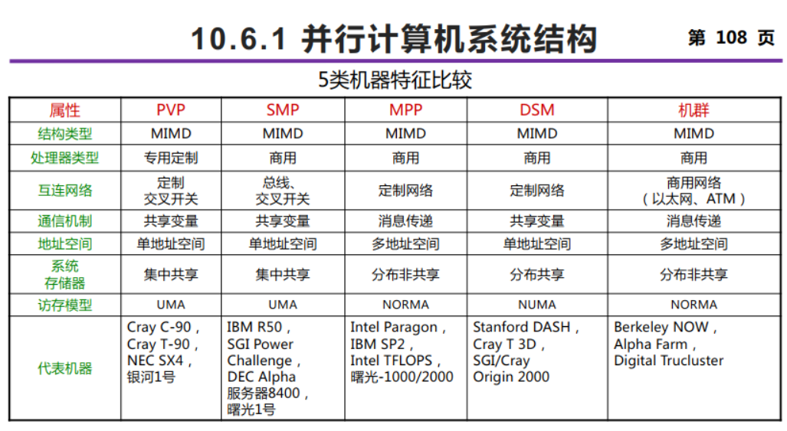

