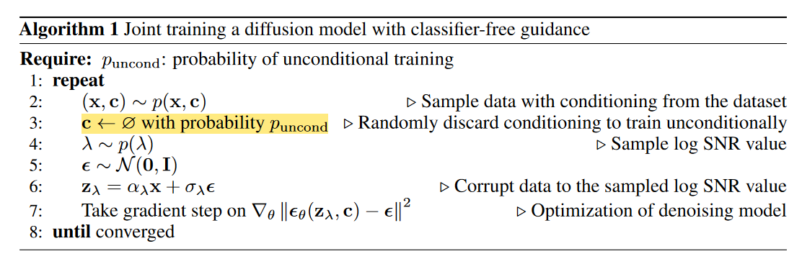

## Note: Guidance

在这篇文章中我们介绍几种常见的为 Diffusion Model 添加 Guidance 的方法。所谓添加 Guidance 是说，我们给定一些额外的 condition（如 text prompt, other images），如何降低生成的多样性，提高生成的准确性，生成与这些 condition 相符的图片。

目前常用的两种加 Guidance 的方法：

+ Classifier Guidance：通过一个 Classifier $p\left(\mathbf{c} \mid \mathbf{z}_t\right)$ 来完成辅助的作用。具体来说，将生成过程的网络预测均值 $\mu_\theta$ 朝着 Classifier 预测结果更加大的方向移动。（这里的 Classifier 不一定局限于分类器，比如在 GLIDE 中可以使用 CLIP score 来作为 Guidance 的优化目标，只要能算梯度就可以）
+ Classifier-free Guidance：不利用 Classifier，而是通过修改训练目标让当前 Diffusion Model 同时具有条件生成和非条件生成的能力。

### Classifier Guidance

正如之前说的，这种方法通过一个 Classifier $p\left(\mathbf{c} \mid \mathbf{z}_t\right)$ 来完成辅助的作用。这种方法不需要额外训练扩散模型，而是直接在已有的 Diffusion Model 上，通过 Classifier 来指导生成所期望的图像。

我们来给出其数学推导。假设我们有扩散模型反向过程 $p_\theta\left(x_t \mid x_{t+1}\right)$ ，如果我们想获得 condition 在 $y$ 上的概率分布 $p_{\theta, \phi}\left(x_t \mid x_{t+1}, y\right)$，我们可以有：
$$
p_{\theta, \phi}\left(x_t \mid x_{t+1}, y\right)=Z p_\theta\left(x_t \mid x_{t+1}\right) p_\phi\left(y \mid x_t\right)
$$
这里 $Z$ 是归一化系数。再记：
$$
\begin{aligned}
p_\theta\left(x_t \mid x_{t+1}\right) & =\mathcal{N}(\mu, \Sigma) \\
\log p_\theta\left(x_t \mid x_{t+1}\right) & =-\frac{1}{2}\left(x_t-\mu\right)^T \Sigma^{-1}\left(x_t-\mu\right)+C
\end{aligned}
$$
我们将 $\log p_\phi\left(y \mid x_t\right)$ 在 $x_t=\mu$ 附近做 Taylor 展开，有：
$$
\begin{aligned}
\log p_\phi\left(y \mid x_t\right) & \left.\approx \log p_\phi\left(y \mid x_t\right)\right|_{x_t=\mu}+\left.\left(x_t-\mu\right) \nabla_{x_t} \log p_\phi\left(y \mid x_t\right)\right|_{x_t=\mu} \\
& =C_1 + \left(x_t-\mu\right) g
\end{aligned}
$$
于是，如果记 $g=\left.\nabla_{x_t} \log p_\phi\left(y \mid x_t\right)\right|_{x_t=\mu}$，那么 condition 在 $y$ 上的概率分布 $p_{\theta, \phi}\left(x_t \mid x_{t+1}, y\right)$ 可以近似地记为：
$$
\begin{aligned}
\log \left(p_\theta\left(x_t \mid x_{t+1}\right) p_\phi\left(y \mid x_t\right)\right) & \approx-\frac{1}{2}\left(x_t-\mu\right)^T \Sigma^{-1}\left(x_t-\mu\right)+\left(x_t-\mu\right) g+C_2 \\
& =-\frac{1}{2}\left(x_t-\mu-\Sigma g\right)^T \Sigma^{-1}\left(x_t-\mu-\Sigma g\right)+\frac{1}{2} g^T \Sigma g+C_2 \\
& =-\frac{1}{2}\left(x_t-\mu-\Sigma g\right)^T \Sigma^{-1}\left(x_t-\mu-\Sigma g\right)+C_3 \\
& =\log p(z)+C_4, z \sim \mathcal{N}(\mu+\Sigma g, \Sigma)
\end{aligned}
$$
这也就是采样过程中梯度反传的来源：

因为我们的 Classifier 要在带噪声的图片上做预测，所以这个 Classifier 最好不要直接用预训练好的模型，应该用其它的数据增广方法使其具有一定的鲁棒性。（如在噪声图片上也做过训练）

### Classifier-free Guidance

上述方法引入的 Classifier 会降低最终 Diffusion Model 的推理速度，而且如果直接使用任务的 Metric 作为 Classifier 的优化目标，也会有拟合 Metric 的嫌疑。这时就有了 Classifier-free 的 Guidance 方法出现：

正如我们上面所说，Classifier-free 的方法不引入 Classifier，而是通过修改训练目标让当前 Diffusion Model 同时具有条件生成和非条件生成的能力。具体来说，在**训练阶段**我们随机 Dropout condition $\mathbf{c}$，而在**测试阶段**我们在生成阶段的去噪过程中，使用下式代替我们预测的噪声结果：
$$
\tilde{\boldsymbol{\epsilon}}_\theta\left(\mathbf{z}_t, \mathbf{c}\right)=w \boldsymbol{\epsilon}_\theta\left(\mathbf{z}_t, \mathbf{c}\right)+(1-w) \boldsymbol{\epsilon}_\theta\left(\mathbf{z}_t\right)
$$
也就是说：

如果设置 $w=1$ 表示我们禁用了这个 Classifier-free 的 Guidance，而在正常使用中我们一般都设置 $w>1$。从隐空间的角度来看，我们实际上是在对 无条件生成时预测的噪声 和 条件生成时预测的噪声 做外插。 

## Latent Space

这一节我们从 Pixel Space 前往 Latent Space，阐释 Stable Diffusion 模型相对于前面的 Diffusion Model 的改进。

首先是 Stable Diffusion 的 Motivation。如果相对一张图片进行压缩，一般分为两个阶段：首先是感知压缩（perceptual compression）阶段，它对应图片中的高频细节；而后是语义压缩（semantic compression）阶段，这个阶段更多的对应数据的语义和概念组成。传统的 Diffusion 方法的生成阶段既要恢复语义的压缩，又要恢复感知层面的压缩，因此花费了大量的计算在高频细节上。而如果我们把 Diffuse 和 Denoise 的对象改为隐空间中对语义对应的 latent code，便可以解决这个麻烦。

于是，我们首先使用 VQGAN 建模这个 pixel space 到 latent space 的转换过程。我们使用一个 Encoder $E$ 和一个 Decoder $D$ 来建模这个转换过程，在训练过程中使用重建 Loss，辅以计算隐空间与标准正态分布的 KL Divergence 作为隐空间正则损失。

之后我们所有的 Diffusion 与 Denoising 过程均在隐空间中进行，操作的具体对象是这个隐空间中的 latent code。

至于加 condition 的方法，我们可以采用 cross attention layer 来进行。具体来说，我们将 condition 用编码器 $\tau_\theta$ 编码，之后将 condition feature 与 latent code 之间做 cross attention，其中 Q 由 latent code 投影得到，K 和 V 由 condition feature 投影得到。