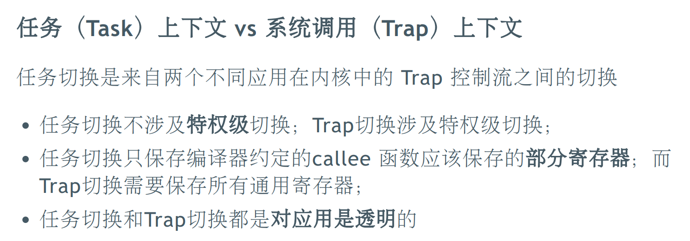
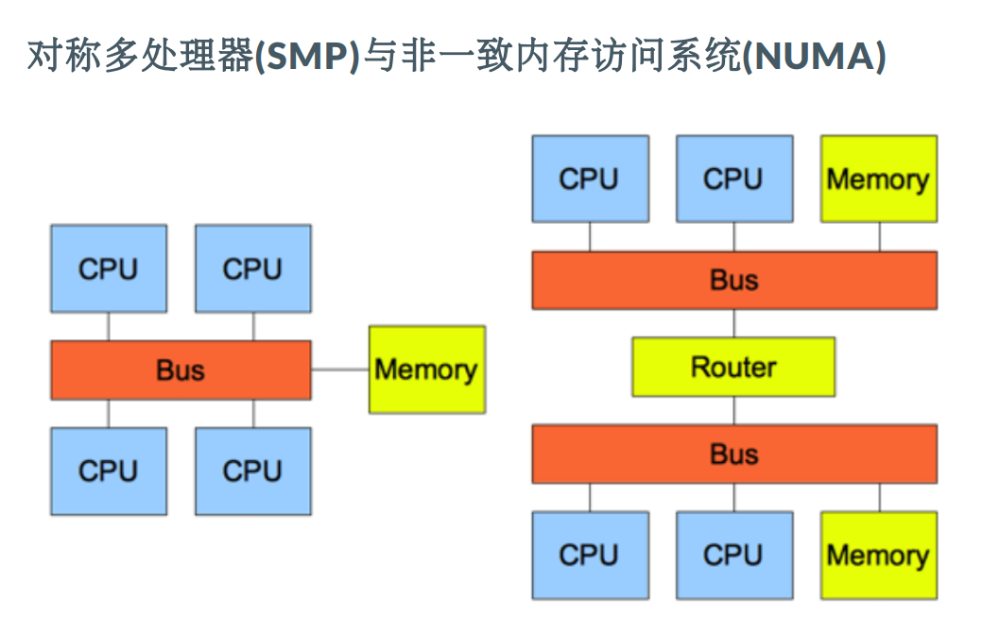
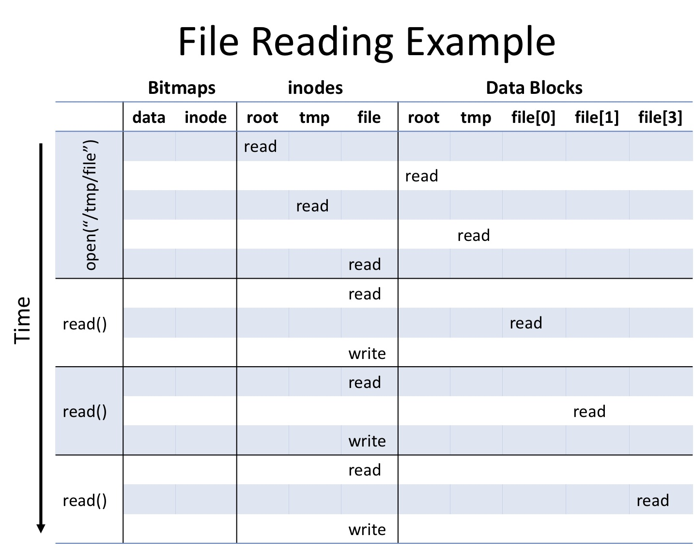
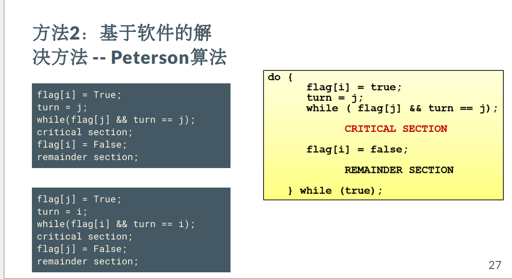
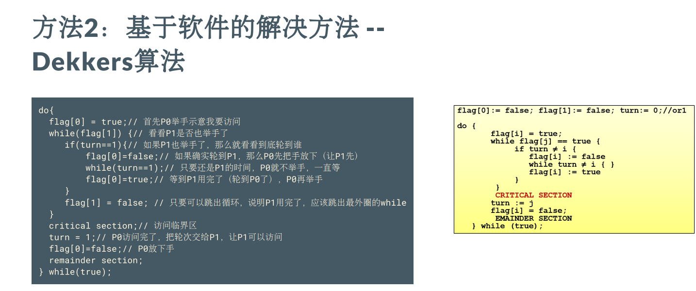
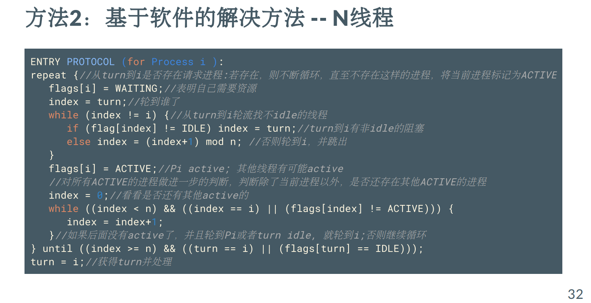
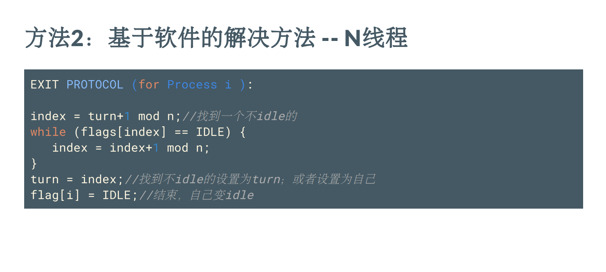

结构非常混乱，因为是考试周拟合一遍所有 Slides 整合出来，目的是在考前 1h 再快速拟合一遍用的 :)

听说期末考试要把同步互斥那边的例子的 Code 都背下来，可怕。


## lec1 OS overview

操作系统是管理硬件资源、控制程序运行、改善人机界面和为应用软件提供支持的一种系统软件。  

抽象：进程、地址空间、文件 -- CPU、内存、 IO 设备

操作系统内核的特征 ：并发 共享 虚拟 异步 持久

单用户系统、批处理系统、多道程序系统、分时系统

简单结构、单体分层结构、微内核结构、外核架构（保护与控制分离 ）、虚拟机结构


**目标三元组**：CPU、操作系统和运行时库等信息


## lec3 ISA TrapCtx & TaskCtx

了解计算机硬件与操作系统的关系：接口/边界

硬件 与 OS 的 边界 ：指令集+寄存器  

了解操作系统与应用程序的关系：接口/边界 

系统调用和地址空间

了解操作系统如何隔离与限制应用程序 控制上 数据上 时间上

特权级机制 地址空间 中断处理 破坏隔离：异常处理  


TrapContext 都有哪些内容？kernel sp, kernel satp, trap handler addr，sstatus, sepc 所有寄存器

什么时候会进行用户栈与内核栈的切换？①执行完毕②做了非法的事情

作业与多道程序，进程与分时多任务。一个具有一定独立功能的程序在一个数据集合上的一次动态执行和资源使用的过程。

进程的特点：动态性 并发性 有限度的独立性

进程 = 程序 + 执行状态

进程状态：控制流+数据




## lec5 mem

OS 中的内存管理方式：重定位、分段、分页、虚拟存储

地址生成时机：编译时、加载时、执行时

内存分配方式：静态内存分配、动态内存分配；在动态内存分配中：连续内存分配、非连续内存分配

栈动态隐式内存分配，堆动态显式内存分配

malloc free 连续

连续内存分配中的动态分区分配策略：最先匹配，最佳匹配，最差匹配

连续内存分配中的伙伴系统

段式存储管理：有段表，位于内存中，由内核管理


## lec6 vm & replacement

覆盖技术（不同时间段内执行的函数或模块共享一块有限的空间，不存在调用关系的模块可相互覆盖 ）、交换技术（操作系统以程序为单位自动换入换出内存）、虚拟存储（虚拟存储 = 内存 + 外存 ，前提是局部性原理）

时间局部性：一条指令的一次执行和下次执行，一个数据的一次访问和下次访问都集中在一个较短时期内

空间局部性：当前指令和邻近时间的几条指令，当前访问的数据和邻近时间访问的几个数据都集中在一个较小区域内

分支局部性：一条跳转指令的两次执行，很可能跳到相同的内存位置  


### **局部页面置换算法**

置换页面的选择范围仅限于当前进程占用的物理页面内。每个任务分配固定大小的物理页，不会动态调整任务拥有的物理页数量；只考虑单个任务的内存访问情况，不影响其他任务拥有的物理内存。

**最优页面置换算法 (OPT, optimal)** 缺页时，计算内存中每个逻辑页面的下一次访问时间；选择未来最长时间不访问的页面  

**先进先出页面置换算法 (FIFO)** 维护一个记录所有位于内存中的逻辑页面链表；表元素按驻留内存的时间排序，链首最长，链尾最短；出现缺页时，选择链首页面进行置换，新页面加到链尾。分配物理页面数增加时，缺页并不一定减少(Belady现象)

**最近最久未使用算法 (LRU, Least Recently Used)**  缺页时，计算内存中每个逻辑页面的上一次访问时间；选择上一次使用到当前时间最长的页面进行置换。

**时钟页面置换算法 (Clock)**  各页面组织成环形链表，指针指向最先调入的页面；页面装入内存时，访问位初始化为0  ;访问页面（读/写)时，访问位置1  ；缺页时，从指针当前位置顺序检查 ：

+ 访问位为0，则置换该页 ，后访问位置1，并指针移动到下一个页面 ；
+ 访问位为1，则访问位置0，并指针移动到下一个页面，直到找到可置换的页面。

**改进的时钟页面置换算法**  减少修改页的缺页处理开销  。访问页面时，在页表项记录页面访问情况  ；修改页面时，在页表项记录页面修改情况  ；缺页时，修改页面标志位，以跳过有修改的页面  。

标志位为两位，读 00 -> 10，写 00 -> 11。

**最不常用置换算法 (LFU, Least Frequently Used )** 缺页时，置换访问次数最少的页面。

**Belady 现象**。分配的物理页面数增加，缺页次数反而升高。OPT 和 LRU 不会有 Belady，不恢复计数的 LFU，FIFO 和 CLOCK 会有 Belady。例子：3 / 4 页帧，1 2 3 4 1 2 5 1 2 3 4 5。

> 期中考完 Update：LFU 那道判断题竟然算没有 Belady 现象，明明不恢复计数的会有，参见 Reference 的那篇 Blog。去查卷也没查出个所以然，但是成功面到了 rls，也算值了 :)


### 全局页面置换算法  

**工作集页面置换算法** 全局页面置换算法：可动态调整某任务拥有的物理内存大小；影响其他任务拥有的物理内存大小。


**常驻集：在当前时刻，进程实际驻留内存中的页面集合**  。工作集是进程在运行过程中的固有性质，常驻集取决于系统分配给进程的物理页面数目和页面置换算法.常驻集包括工作集时，缺页较少。

**工作集替换算法**：每次访存换出不在工作集中的页面  。

**缺页率页面置换算法** 缺页率：缺页次数 / 内存访问次数 或 缺页平均时间间隔的倒数。通过调节常驻集大小，使每个进程的缺页率保持在一个合理的范围内  。


**抖动问题**  由于分配给进程的物理页面太少无法包含工作集导致大量缺页而频繁置换，从而进程运行速度变慢。操作系统需在并发水平和缺页率之间达到一个平衡 。


## lec7 & 8 scheduler

一个具有一定独立功能的程序在某数据集合上的一次执行和资源使用的动态过程

任务和进程的区别？进程可以在运行的过程中，创建子进程 、 用新的程序内容覆盖已有的程序内容；进程成为程序执行过程中动态申请/使用/释放各种资源的载体  

shell 启动过程：OS 初始化，找到 initproc执行程序并创建其 PCB，然后执行 initproc，它执行 fork+exec user_shell，执行 waitpid 等待子进程

### 单处理机调度

进程在CPU计算和I/O操作间交替。每次调度决定在下一个CPU计算时将哪个工作交给CPU 。

吞吐量与延迟有 trade off。

#### 调度算法

**先来先服务调度算法FCFS** 依据进程进入就绪状态的先后顺序排列。指标是周转时间，为结束时间的均值。

**短作业优先调度算法SJF** 选择就绪队列中执行时间最短作业/进程占用CPU进入运行状态  。就绪队列按预期的执行时间来排序  。

**最短剩余时间算法SRT**  有新的进程就绪，且新进程的服务时间小于当前进程的剩余时间，则转到新的进程执行 。抢占式。

**最高响应比优先算法HRRN** 选择就绪队列中响应比R值最高的进程，R = (就绪等待时间 / 执行时间) + 1。

**时间片轮转算法RR**  时间片结束时，按FCFS算法切换到下一个就绪进程。

**多级队列调度算法MQ**  就绪队列被划分成多个独立的子队列；同一优先级的进程属于某个队列，且不能跨越队列

**多级反馈队列调度算法MLFQ** 工作进入系统时，放在最高优先级；如进程在当前的时间片没有完成，则降到下一个优先级；如果工作在其时间片以内主动释放CPU，则优先级不变；时间片大小随优先级级别增加而增加；经过一段时间S，就将系统中所有工作重新加入最高优先级队列。

#### 实时调度算法

Real-time OS: 正确性依赖于其时间和功能两方面的操作系统。

实时操作系统的性能指标：时间约束的及时性（deadlines）

**静态优先级调度：速率单调调度算法（Rate Monotonic）**  根据任务周期来确定任务优先级（周期越短优先级越高，抢占式）。

**动态优先级调度：最早截止时间优先算法（EDF, Earliest Deadline First）**  任务的优先级根据任务的截止时间动态分配。截止时间越短，优先级越高。

**最低松弛度优先算法（LLF）**  根据任务紧急或者松弛程度，来确定任务优先级。松弛度=必须完成时间-本身还需要运行时间-当前时间。

**优先级反置**：高优先级进程长时间等待低优先级进程所占用资源的现象。


两种解决方案：① **优先级继承**。占用资源的低优先级进程继承申请资源的高优先级进程的优先级。只在占有资源的低优先级进程被阻塞时，才提高占有资源进程的优先级。② **优先级天花板协议**：占用资源进程的优先级与所有可能申请该资源的进程的最高优先级相同；不管是否发生等待,都提升占用资源进程的优先级；优先级高于系统中所有被锁定的资源的优先级上限，任务执行临界区时就不会被阻塞。

### 多处理机调度



SMP是指对称多处理器结构，是指服务器中多个CPU对称工作，无主次或从属关系。各CPU共享相同的物理内存，每个 CPU访问内存中的任何地址所需时间是相同的，因此SMP也被称为一致存储器访问结构。

NUMA 架构为非一致性存储器访问架构。NUMA 服务器的基本特征是具有多个CPU模块，每个CPU模块由多个CPU(如4个)组成，并且具有独立的本地内存、I/O槽口等。

MMP 也被称为海量并行处理架构。MPP 提供了另外一种进行系统扩展的方式，它由多个SMP服务器通过一定的节点互联网络进行连接，协同工作，完成相同的任务，从用户的角度来看是一个服务器系统。

**单队列多处理器调度 SQMS（Multiprocessor Scheduling）**  缺乏可扩展性，缓存亲和性弱。

**多队列多处理器调度 MQMS**   每个 CPU 调度相互独立，避免单队列方式的数据共享及同步问题。但是，可能存在负载不均衡的问题。这可以通过**进程迁移**或者**工作窃取**缓解。

虽然很有意思但是 Linux 内的调度算法与历史演进过程的三节不考 :)


## lec9 fs

文件系统是存储设备上组织文件的方法和数据结构，是管理持久性数据的子系统，是操作系统中负责文件命名、存储和检索的子系统。

文件是具有符号名，由字节序列构成的数据项集合。文件头：文件系统元数据中的文件信息。UNIX类操作系统的一个设计哲学：一切都是文件。

文件系统的存储视图：SuperBlock, inode, dir_entry, data block。

文件数据块的分配方式：① 连续分配（高效的顺序和随机读访问；频繁分配会带来碎片；增加文件内容开销大） ② 链式分配（创建、增大、缩小很容易；几乎没有碎片；随机访问效率低，可靠性差；分为显式链接和隐式链接，前者显式建立常驻内存的文件分配表 FAT 记录盘块的先后关系，隐式则是盘块中记录下一个盘块的指针） ③ 索引分配（创建、增大、缩小很容易；几乎没有碎片；支持直接访问；当文件很小时，存储索引的开销相对大）

为了处理大文件，引入链式索引 / 多级索引的索引分配方式。



每次读数据需要 Read Inode, Read Data, Write Inode


如果需要创建一个新的 Inode  / Data block，则需要对对应的 bitmap 先 R 后 W，创建新文件需要 write 新文件的 inode，父目录的 inode 和父目录的 data block。对文件写入则需要 R Inode，W 数据块，W Inode。

多数磁盘划分为一个或多个分区，每个分区有一个独立的文件系统。

**崩溃一致性问题**（crash-consistency problem）也称一致性更新问题（consistent-update problem）特定操作需要更新磁盘上的两个结构A和B。磁盘一次只为一个请求提供服务，因此其中一个请求将首先到达磁盘（A或B）。如果在一次写入完成后系统崩溃或断电，则磁盘上的结构将处于不一致（inconsistent）的状态。

文件系统检查程序 fsck 是一种修复方案，允许不一致的事情发生，然后在重启时修复它们。目标：确保文件系统**元数据**内部一致。缺点是慢、可能丢数据。

**数据日志**的更新流程：

1. 日志写入 Journal write：将事务的内容（包括TxB、元数据和数据）写入日志，等待这些写入完成。

2. 日志提交 Journal Commit：将事务提交块（包括TxE）写入日志，等待写完成，事务被认为已提交（committed）。
3. 加检查点 Checkpoint：将更新内容（元数据和数据）写入其最终的磁盘位置。

数据日志的崩溃恢复：

- 崩溃发生在Journal Commit完成前：文件系统可以丢掉之前写入的log。由于磁盘具体位置的bitmap，inodes，data blocks都没变，所以可以确保文件系统一致性。  
- 崩溃发生在Journal Commit后，Checkpoint之前：文件系统在启动时候，可以扫描所有已经commited的log，然后针对每一个log记录操作进行replay，即recovery的过程中执行Checkpoint，将log的信息回写到磁盘对应的位置。这种操作也成为redo logging。
- 崩溃发生在Checkpoint完成后：那无所谓，都已经成功回写到磁盘了，文件系统的bitmap、inodes、data blocks也能确保一致性。

日志文件系统的性能优化：太多写，慢！从记录数据+元数据日志，转变成只记录元数据日志。

不同日志模式：

Journal Mode: 操作的metadata和file data都会写入到日志中然后提交，这是最慢的。Ordered Mode: 只有metadata操作会写入到日志中，但是确保数据在日志提交前写入到磁盘中，速度较快。Writeback Mode: 只有metadata操作会写入到日志中，且不确保数据在日志提交前写入，速度最快。


## lec10 & 11 IPC 线程与协程

**进程间通信**的定义：各进程之间通过**数据交换**（共享或传递）进行**交互**的行为，分为直接通信（不需要 OS 中转）和间接通信两种方式。


进程是资源（包括内存、打开的文件等）分配的单位，线程是 CPU 调度的单位。线程是进程的一部分，描述指令流执行状态。线程 = 进程 - 共享资源。线程的**设计实现**有以下方式：

+ 用户态管理且用户态运行的线程（内核不可见的用户线程）  
+ 内核态管理且用户态运行的线程
+ 内核态管理且内核态运行的线程
+ 双态管理的线程（轻量级进程，LWP）


相同进程中的线程切换：虚拟内存是共享的，切换时虚拟内存这些资源就保持不动，只需要切换线程的私有数据、寄存器等不共享的数据。

**协程**的核心思想：控制流的主动让出与恢复。无栈协程是普通函数的泛化。优点：协程创建成本小，降低了内存消耗；协程自己的调度器，减少了 CPU 上下文切换的开销，提高了 CPU 缓存命中率；减少同步加锁，整体上提高了性能；可按照同步思维写异步代码。协程适合**IO密集型**场景。

依照三个因素来对协程进行分类：

+ 控制（控制权）传递机制：对称协程（等价） / 非对称协程（调用与挂起）
+ 栈式构造：有栈协程 / 无栈协程
+ 编程语言中第一类（First-class）对象：First-class对象 / second-class对象

需要切换的内容：进程：页表，堆，栈，寄存器；线程：栈，寄存器；协程：寄存器。


## lec12 同步互斥

临界区(Critical Section) -- 访问规则

+ 空闲则入：没有线程在临界区时，任何线程可进入
+ 忙则等待：有线程在临界区时，其他线程均不能进入临界区
+ 有限等待：等待进入临界区的线程不能无限期等待
+ 让权等待（可选）：不能进入临界区的线程，应释放CPU（如转换到阻塞状态）

同步互斥的方法：

+ 方法1：禁用硬件中断（进入临界区：禁止所有中断，并保存标志；离开临界区：使能所有中断，并恢复标志）
+ 方法2：基于软件的解决方法









+ 方法3：更高级的抽象方法（锁，使用 TestAndSet / CaS，自旋锁或忙等锁 v.s. 等待锁）

信号量（互斥访问 和 条件同步）：P 尝试减少，如果 < 0 进入等待，否则继续；V 是增加，如果 <= 0 唤醒一个等待的。

管程：一个管程是一个基本程序单位，是一种特殊的数据类型，其中不仅有数据，而且有对数据进行操作的代码。


【读者写者问题的信号量实现】

https://en.wikipedia.org/wiki/Readers%E2%80%93writers_problem#cite_note-3

**读者优先**

```c
semaphore resource=1;
semaphore rmutex=1;
readcount=0;

/*
   resource.P() is equivalent to wait(resource)
   resource.V() is equivalent to signal(resource)
   rmutex.P() is equivalent to wait(rmutex)
   rmutex.V() is equivalent to signal(rmutex)
*/

writer() {
    resource.P();          //Lock the shared file for a writer

    <CRITICAL Section>
    // Writing is done

    <EXIT Section>
    resource.V();          //Release the shared file for use by other readers. Writers are allowed if there are no readers requesting it.
}

reader() {
    rmutex.P();           //Ensure that no other reader can execute the <Entry> section while you are in it
    <CRITICAL Section>
    readcount++;          //Indicate that you are a reader trying to enter the Critical Section
    if (readcount == 1)   //Checks if you are the first reader trying to enter CS
        resource.P();     //If you are the first reader, lock the resource from writers. Resource stays reserved for subsequent readers
    <EXIT CRITICAL Section>
    rmutex.V();           //Release

    // Do the Reading

    rmutex.P();           //Ensure that no other reader can execute the <Exit> section while you are in it
    <CRITICAL Section>
    readcount--;          //Indicate that you no longer need the shared resource. One fewer reader
    if (readcount == 0)   //Checks if you are the last (only) reader who is reading the shared file
        resource.V();     //If you are last reader, then you can unlock the resource. This makes it available to writers.
    <EXIT CRITICAL Section>
    rmutex.V();           //Release
}
```

**写者优先**

```c
int readcount, writecount;                   //(initial value = 0)
semaphore rmutex, wmutex, readTry, resource; //(initial value = 1)

//READER
reader() {
<ENTRY Section>
  readTry.P();                 //Indicate a reader is trying to enter
  rmutex.P();                  //lock entry section to avoid race condition with other readers
  readcount++;                 //report yourself as a reader
  if (readcount == 1)          //checks if you are first reader
    resource.P();              //if you are first reader, lock the resource
  rmutex.V();                  //release entry section for other readers
  readTry.V();                 //indicate you are done trying to access the resource

<CRITICAL Section>
//reading is performed

<EXIT Section>
  rmutex.P();                  //reserve exit section - avoids race condition with readers
  readcount--;                 //indicate you're leaving
  if (readcount == 0)          //checks if you are last reader leaving
    resource.V();              //if last, you must release the locked resource
  rmutex.V();                  //release exit section for other readers
}

//WRITER
writer() {
<ENTRY Section>
  wmutex.P();                  //reserve entry section for writers - avoids race conditions
  writecount++;                //report yourself as a writer entering
  if (writecount == 1)         //checks if you're first writer
    readTry.P();               //if you're first, then you must lock the readers out. Prevent them from trying to enter CS
  wmutex.V();                  //release entry section
  resource.P();                //reserve the resource for yourself - prevents other writers from simultaneously editing the shared resource
<CRITICAL Section>
  //writing is performed
  resource.V();                //release file

<EXIT Section>
  wmutex.P();                  //reserve exit section
  writecount--;                //indicate you're leaving
  if (writecount == 0)         //checks if you're the last writer
    readTry.V();               //if you're last writer, you must unlock the readers. Allows them to try enter CS for reading
  wmutex.V();                  //release exit section
}
```

**保证公平防止饥饿**

```c
int readcount;                // init to 0; number of readers currently accessing resource

// all semaphores initialised to 1
semaphore resource;           // controls access (read/write) to the resource. Binary semaphore.
semaphore rmutex;             // for syncing changes to shared variable readcount
semaphore serviceQueue;       // FAIRNESS: preserves ordering of requests (signaling must be FIFO)

//READER
reader() {
<ENTRY Section>
  serviceQueue.P();           // wait in line to be serviced
  rmutex.P();                 // request exclusive access to readcount
  readcount++;                // update count of active readers
  if (readcount == 1)         // if I am the first reader
    resource.P();             // request resource access for readers (writers blocked)
  serviceQueue.V();           // let next in line be serviced
  rmutex.V();                 // release access to readcount
    
<CRITICAL Section>
//reading is performed
    
<EXIT Section>
  rmutex.P();                 // request exclusive access to readcount
  readcount--;                // update count of active readers
  if (readcount == 0)         // if there are no readers left
    resource.V();             // release resource access for all
  rmutex.V();                 // release access to readcount
}

//WRITER
writer() {
<ENTRY Section>
  serviceQueue.P();           // wait in line to be serviced
  resource.P();               // request exclusive access to resource
  serviceQueue.V();           // let next in line be serviced
    
<CRITICAL Section>
// writing is performed
    
<EXIT Section>
  resource.V();               // release resource access for next reader/writer
}
```


死锁问题 -- 必要条件：

+ 互斥：任何时刻只能有一个进/线程使用一个资源实例
+ 持有并等待：进/线程保持至少一个资源，并正在等待获取其他进程持有的资源
+ 非抢占：资源只能在进程使用后自愿释放
+ 循环等待：存在等待进程集合，进程间形成相互等待资源的环

死锁问题的避免：银行家算法


除了死锁避免算法之外，我们还可以利用死锁检测与恢复（允许出现死锁）的算法。死锁检测算法与上面判断安全状态的例程相似，但注意将 Allocation==0 的线程的 finish 直接设置为 true。恢复包括进程终止和资源抢占两种方式。


## Reference

+ 2023S 《操作系统》课程 Slides
+ https://learningos.github.io/rCore-Tutorial-Guide-2023S/index.html
+ https://twinkle0331.github.io/categories/Systems/

