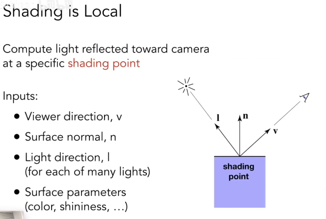
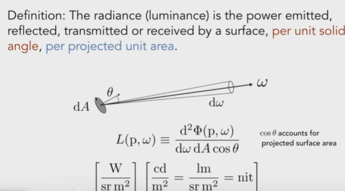
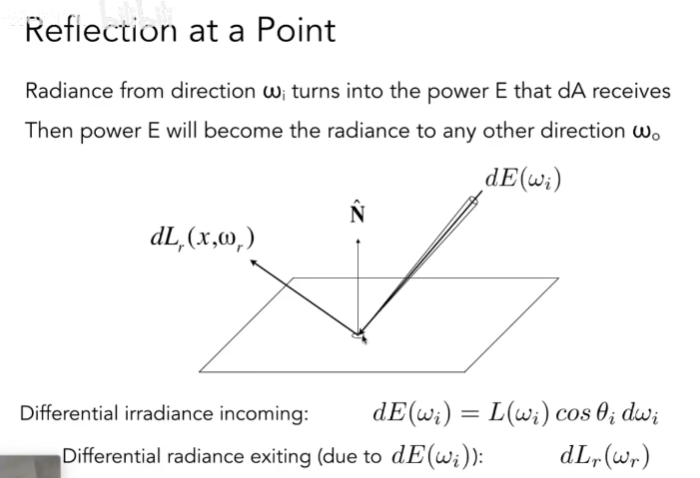
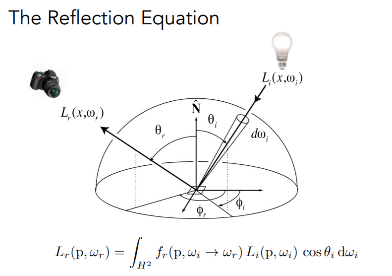
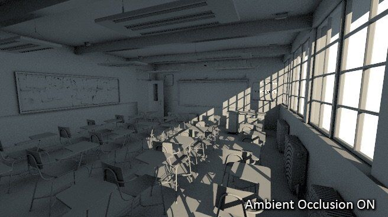

这篇 blog 对图形学中学到的相关概念进行回顾 :)

## Blinn-Phong 着色模型

**着色模型**是计算机图形学中的一个概念，用于描述**如何计算在给定光照条件下，图形物体的颜色**。**着色**（Shading）指的是计算图形物体表面各点颜色的过程。它是用于将三维物体渲染成二维图像的重要步骤之一。

着色是具有**局部性**的（Shading Locality），这是说在着色计算中，每个像素的颜色值只与其周围相对较小区域内的几何形状和光照条件有关。在着色计算的过程中，我们只考虑参与着色计算的这个物体，而没有考虑其他物体，这样是无法表现阴影的。

**Blinn-Phong 着色模型**是一种基于 Phong 着色模型的改进，是 OpenGL 和 Direct3D 等渲染库的默认着色模型。它使用了半程向量（Halfway Vector）的概念来计算镜面高光（Specular Highlight），比 Phong 模型更加精确地模拟了光的反射和物体表面的光滑程度。具体来说，Blinn-Phong 着色模型使用了以下三个分量来计算最终颜色：

1. **漫反射分量**：表示光线照射到物体表面后被散射的部分，这部分颜色通常与物体表面的颜色相同或类似。
2. **镜面反射分量**：表示光线照射到物体表面后发生镜面反射的部分，通常呈现为白色高光。Blinn-Phong 着色模型使用半程向量来计算这个分量。
3. **环境光分量**：表示在没有直接光照的情况下，物体表面被间接照射的部分，通常呈现为比较暗淡的颜色。这个分量可以理解为整个场景的背景色或环境色。

**漫反射 Diffuse Reflection**  对于某一个平面的漫反射项，假设某光源的光照强度为 $I_d$，距离着色点的距离为 $r$，着色点的漫反射系数为  $k_d$，$\vec{n}$ 表示物体表面的法向量，$\vec{l}$ 表示从物体表面指向光源的向量。那么漫反射项可以表示为：
$$
L_d = k_{d} \frac{I_{d}}{r^2} \max(0, \vec{n} \cdot \vec{l})
$$
**高光项 Specular Term**  基于如果视线方向 $\vec v$ 和镜面方向相近，那么半程向量就跟平面法向相近的事实，我们定义半程向量 $\vec h := \text{bisector}(\vec v, \vec l) = \frac{v+l}{||v+l||}$。然后我们可以定义高光项：
$$
L_s = k_{s} \frac{I_{s}}{r^2} \max(0, \vec{n} \cdot \vec{h})^{p}
$$
其中，$I_{s}$ 表示光源的强度，距离着色点的距离为 $r$，$k_{s}$ 表示物体表面的镜面反射系数，$\vec{n}$ 表示物体表面的法向量，$\vec{h}$ 表示半程向量，$p$ 表示反射高光的粗糙程度，一般取值在 $1$ 到 $1000$ 之间。为什么要带有 $p$ 次方呢？这是因为我们想让产生高光的夹角处于一个相对较小的范围：

**环境光照 Ambient Term**  环境光照的强度不取决于物体，我们在这里大胆假设每个地方、每个方向的环境光照的大小都相同。也就是说，这一项会填充图中的黑色区域，将图像整体提升某个光照强度。形式化地，可以表示为：
$$
L_a = k_a I_a
$$
最终 Blinn-Phong 着色模型的实现就是上述三项相加。

## 辐射度量学，BRDF 与渲染方程

### 辐射度量学

**辐射度量学**提供了**在物理上**精准地描述光这个物理量的方法。我们将 Cover 以下概念：

- Radiant Flux 辐射通量
- Radiant Intensity 辐射强度
- Irradiance 辐射照度
- Radiance 辐射亮度

**Radiant flux**  辐射通量（Radiant flux）是指电磁波或其他形式的辐射能量的总量，通常以**单位时间内辐射出的能量总量**来度量，单位是瓦特（W）或者流明（lumen, lm）。它是一个物理量，用于描述从光源或辐射源发出的辐射能量的总量。辐射通量不仅包括可见光，还包括其他电磁波，如紫外线、红外线和微波等。

**Radiant intensity**  辐射强度（Radiant intensity）是指**单位立体角**内，从辐射源某一方向发出的辐射功率密度，单位是**瓦特每立体弧度**（W/sr，记为“坎德拉” cd）。它是一个物理量，用于描述辐射源在某个方向上发射光线的强度。数学定义为 $I(\omega) = \frac{d\Phi}{d\omega}$，这里 $\Phi$ 是 radiant flux。特别地，若光源均匀辐射，则我们有 $I = \frac{\Phi}{4 \pi}$。

**Irradiance**  辐照度（Irradiance）是指单位面积（该平面要与光线垂直）上接收到的辐射功率，通常用**瓦特每平方米**（W/m²，lux）来表示。辐照度是一个物理量，用于描述辐射源向表面或物体发射的辐射能量在单位面积上的分布情况。数学定义为 $E(x) = \frac{d\Phi(x)}{dA}$。

**Radiance**  辐射度（Radiance）是**每单位立体角**和**每单位投影面积**上，由表面反射、发射或接收的能量。辐射度是**光线的属性**。数学定义上，$L(p, \omega) = \frac{d^2\Phi(p, \omega)}{d\omega dA \cos \theta}$。

Irradiance 是一个表面 $dA \cos \theta$ 接收到的能量，Radiance 是该表面朝着某个 $\omega$ 立体角方向辐射出去或接收到的能量，后者具有表明方向的能力。二者关系可以表述为：
$$
E(p) = \int_{H^2} L_i(p, \omega) \cos \theta \ d\omega
$$
这里 $H^2$ 表示半球面。

### BRDF  双向反射分布函数

BRDF（Bidirectional Reflectance Distribution Function）用于描述光在物体表面反射的方式。它是指在**给定入射角和出射角**的情况下，**物体表面对于入射光线反射光线的能量分布情况**。

从 $\omega_i$ 方向到达物体表面的 Radiance 会被转换成能量 $E$ 进而被物体表面吸收，而物体表面吸收的能量又会转化成分散到 $\omega_o$ 方向的 Radiance。BRDF 表述的就是这两个 Radiance 之间的比例关系。

使用 BRDF 可以用来定义镜面反射和漫反射。此外，BRDF 还可以用来定义物体表面的材质。

### 渲染方程

于是，借助于 BRDF 的定义，我们考虑真实的光线传播。

首先我们来考虑**反射方程**。从某个点 $dA$ 向 $\omega_r$ 方向出射的 radiance，可以通过考虑所有 $dA$ 到达这个点的 radiance 乘以其对应的 BRDF 占比，然后求和得到。

有了反射方程之后，我们自然而然就可以得出**渲染方程**：
$$
L_{o}\left(p, \omega_{o}\right)=L_{e}\left(p, \omega_{o}\right)+\int_{\Omega^{+}} L_{i}\left(p, \omega_{i}\right) f_{r}\left(p, \omega_{i}, \omega_{o}\right)\left(n \cdot \omega_{i}\right) \mathrm{d} \omega_{i}
$$
渲染方程是反射方程项加上物体表面相对于 $\omega_o$ 方向的自发光项。

## 材质与外观 Materials and Appearance

在图形学中，材质可以用 BRDF 来表示。接下来，我们介绍几种典型的材质。

### 漫反射材料 Diffuse/Lambertian Material

我们定义漫反射材料会将任何方向的入射光均匀地分散到所有的出射方向上。其 BRDF 的分布情况由由上图所示。

如果我们假设入射光也是均匀分布在各个角度上的（$L_{i}\left(\omega_{i}\right) = L_i$），BRDF 对于各个出射方向也是常数 $f_r$，物体表面不会自发光，我们直接套用渲染方程的定义可以得到：
$$
\begin{aligned}
L_{o}\left(\omega_{o}\right) &=\int_{H^{2}} f_{r} L_{i}\left(\omega_{i}\right) \cos \theta_{i} \mathrm{~d} \omega_{i} \\
&=f_{r} L_{i} \int_{H^{2}}\cos \theta_{i} \mathrm{~d} \omega_{i} \\
&=\pi f_{r} L_{i}
\end{aligned}
$$
这里 $d \omega_i = r^2 \sin\theta \ d\phi \ d\theta$。进而我们可以定义：
$$
{\rho} := f_{r}{\pi}
$$
这里 $\rho$ 就是我们说的 Albedo Color，称为物体表面的反射率，其取值在 $[0, 1]$ 之间，表示物体表面对均匀入射光 $L_i$ 的反射率 $\frac{L_o(\omega_o)}{L_i}$。这里 Albedo 可以是单通道的值，也可以是光谱的连续函数，但一般我们使用三通道 RGB 来表示分别对三种颜色的反射率。

### 抛光的金属 Glossy Material

### 理想反射/折射材质

## Texture Maps

+ **Albedo Map**：表示物体表面对于不同波长的光线反射的比例，即表面的基本颜色。

+ **Normal Map** (Bump Map)：法线贴图通过改变光线反射的方向，来使得着色看起来具有纹理和深度。

+ **Roughness Map** (Gloss Map)：粗糙度贴图用于控制物体表面的粗糙度。物体表面的粗糙度会影响光线的反射或折射方式，从而影响阴影和高光的形成。
  + 当光线照射到表面时，部分光线会被反射出去，而部分光线会被折射进入物体内部。表面的粗糙度会影响反射和折射光线的分布情况。
  + 如果表面非常光滑，即表面的粗糙度很小，反射光线的分布比较集中，高光区域很明显，而阴影区域很小。相反，如果表面非常粗糙，即表面的粗糙度很大，反射光线的分布比较散乱，高光区域会被扩散，而阴影区域会变大。
+ **Metalness Map**：Metallic 属性描述了物体表面材料的金属特性。金属质感主要影响物体表面的颜色和反射效果。金属表面通常具有高度反射性，同时反射的颜色与金属本身的颜色相近。
  + Metallic（金属质感）和 Smoothness（光滑度）是 BRDF 中的两个关键属性，分别影响材质的反射颜色和高光反射效果。在 BRDF 中，这两个属性主要影响以下两个方面：
    + Diffuse（漫反射）和 Specular（镜面反射）分量：金属质感（Metallic）在 BRDF 中主要影响 Diffuse 和 Specular 分量的权重。对于金属材质，Diffuse 分量较小或接近于零，而 Specular 分量较大，反射光的颜色接近于材质本身的颜色。对于非金属材质，Diffuse 分量较大，Specular 分量较小，反射光的颜色接近于白色。
    + Specular 的光滑度：Smoothness 在 BRDF 中主要影响镜面反射（Specular）的分布。光滑度越高，Specular 分量的分布越集中，高光反射越明显，物体表面看起来越光滑。相反，光滑度较低时，Specular 分量的分布较为分散，高光反射效果较弱，物体表面看起来较为粗糙
+ **Height / Displacement Map**：Height map（高度图）和 Displacement map（位移图）通过表示表面高度变化来增强物体的外观，使其看起来更加真实和复杂。
  + Height Map（高度图）：高度图是一种灰度图像，用于表示物体表面上的高度差异。亮度值较高的像素表示表面凸起的区域，而亮度值较低的像素表示凹陷的区域。这样可以在保持较低的计算资源消耗的同时实现较好的视觉效果。但是，高度图不能真正改变物体的几何形状，因此在侧面观察时可能无法完全实现真实的立体效果。
  + Displacement Map（位移图）：位移图与高度图类似，也是用于表示物体表面上的高度差异。但是，位移图会直接影响物体的几何形状，通过在渲染时实际地改变物体的顶点位置来实现更真实的凹凸效果。位移贴图通常需要更多的计算资源，因为它们需要在渲染过程中动态地细分和移动物体的表面。

+ **Ambient Occlusion**：“环境吸收”或者“环境光吸收”图。如果入射光线过强时，AO 技术可以让阴影更加柔和，更加真实。

## 参考资料

+ GAMES101-现代计算机图形学入门
+ https://www.vntana.com/blog/what-are-texture-maps-and-why-do-they-matter-for-3d-fashion/