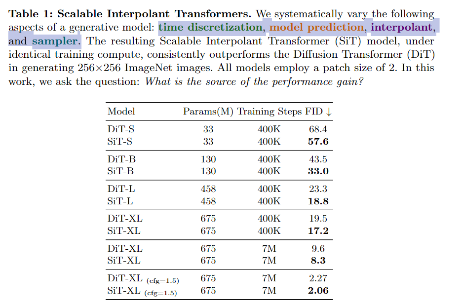

今天详细介绍的 Paper，是下面这篇：

**SiT: Exploring Flow and Diffusion-based Generative Models with Scalable Interpolant Transformers**

题目中的 Flow and Diffusion-based 分别指的是 Flow matching 和 Diffusion modeling 两种做生成建模的方式；Scalable Interpolant Transformers 中，Scalable Transformers 是 saining 组 ICCV’23 的力作 DiT，Interpolant 是将 Flow and Diffusion-based Modeling 统一的一个话术。

这篇 paper 将图像生成模型的搜索空间（除网络架构之外）定义为：



我们用两个主要的对象，Transport 与 Sampler 来描述 Diffusion 过程的定义 与 对该过程的采样。

## Transport

该类型的参数定义：

```python
def parse_transport_args(parser):
    group = parser.add_argument_group("Transport arguments")
    group.add_argument("--path-type", type=str, default="Linear", choices=["Linear", "GVP", "VP"])
    group.add_argument("--prediction", type=str, default="velocity", choices=["velocity", "score", "noise"])
    group.add_argument("--loss-weight", type=none_or_str, default=None, choices=[None, "velocity", "likelihood"])
    group.add_argument("--sample-eps", type=float)
    group.add_argument("--train-eps", type=float)
```

该类型在训练中的位置：

```python
transport = create_transport(
    args.path_type,
    args.prediction,
    args.loss_weight,
    args.train_eps,
    args.sample_eps
)

logger.info(f"Training for {args.epochs} epochs...")
for epoch in range(args.epochs):
    sampler.set_epoch(epoch)
    logger.info(f"Beginning epoch {epoch}...")
    for x, y in loader:
        x = x.to(device)
        y = y.to(device)
        with torch.no_grad():
            # Map input images to latent space + normalize latents:
            x = vae.encode(x).latent_dist.sample().mul_(0.18215)
        model_kwargs = dict(y=y)
        loss_dict = transport.training_losses(model, x, model_kwargs) #! Here
        loss = loss_dict["loss"].mean()
        opt.zero_grad()
        loss.backward()
        opt.step()
        update_ema(ema, model.module)
```

下面给出关于 training losses 的定义：

```python
def training_losses(
    self, 
    model,  
    x1, 
    model_kwargs=None
):
    """Loss for training the score model
    Args:
    - model: backbone model; could be score, noise, or velocity
    - x1: datapoint
    - model_kwargs: additional arguments for the model
    """
    if model_kwargs == None:
        model_kwargs = {}
    
    t, x0, x1 = self.sample(x1)  #! Sampling x0 & t based on shape of x1 (if needed)
    t, xt, ut = self.path_sampler.plan(t, x0, x1)  #! Get x_t according to path planner
    model_output = model(xt, t, **model_kwargs)
    B, *_, C = xt.shape
    assert model_output.size() == (B, *xt.size()[1:-1], C)

    terms = {}
    terms['pred'] = model_output
    if self.model_type == ModelType.VELOCITY:
		    #! Calculate loss according to prediction type
        terms['loss'] = mean_flat(((model_output - ut) ** 2))
    else: 
        _, drift_var = self.path_sampler.compute_drift(xt, t)
        sigma_t, _ = self.path_sampler.compute_sigma_t(path.expand_t_like_x(t, xt))

				#! Calculate loss according to weighting type (conditioned on t)
        if self.loss_type in [WeightType.VELOCITY]:
            weight = (drift_var / sigma_t) ** 2
        elif self.loss_type in [WeightType.LIKELIHOOD]:
            weight = drift_var / (sigma_t ** 2)
        elif self.loss_type in [WeightType.NONE]:
            weight = 1
        else:
            raise NotImplementedError()
        
        #! Calculate loss according to prediction type
        if self.model_type == ModelType.NOISE:
            terms['loss'] = mean_flat(weight * ((model_output - x0) ** 2))
        else:  # ModelType.SCORE, predicting -x0/sigma_t
            terms['loss'] = mean_flat(weight * ((model_output * sigma_t + x0) ** 2))
            
    return terms

def sample(self, x1):
    """Sampling x0 & t based on shape of x1 (if needed)
      Args:
        x1 - data point; [batch, *dim]
    """
    
    x0 = th.randn_like(x1)
    t0, t1 = self.check_interval(self.train_eps, self.sample_eps)  # Related with Path Planning
    t = th.rand((x1.shape[0],)) * (t1 - t0) + t0
    t = t.to(x1)
    return t, x0, x1
```

### Path Planning


下面我们给出几个常用的 Path 定义方式。


（The only design flexibility in the above equation comes from the choice of betas. Otherwise, t=1 does not imply alpha approaches zero.）


这几种 Path 的定义为：

```python

class ICPlan:
    """Linear Coupling Plan"""

    def compute_alpha_t(self, t):
        """Compute the data coefficient along the path"""
        return t, 1
    
    def compute_sigma_t(self, t):
        """Compute the noise coefficient along the path"""
        return 1 - t, -1
    
    def compute_d_alpha_alpha_ratio_t(self, t):
        """Compute the ratio between d_alpha and alpha"""
        return 1 / t

    def compute_mu_t(self, t, x0, x1):
        """Compute the mean of time-dependent density p_t"""
        t = expand_t_like_x(t, x1)
        alpha_t, _ = self.compute_alpha_t(t)
        sigma_t, _ = self.compute_sigma_t(t)
        return alpha_t * x1 + sigma_t * x0
    
    def compute_xt(self, t, x0, x1):
        """Sample xt from time-dependent density p_t; rng is required"""
        xt = self.compute_mu_t(t, x0, x1)
        return xt
    
    def compute_ut(self, t, x0, x1, xt):
        """Compute the vector field corresponding to p_t"""
        t = expand_t_like_x(t, x1)
        _, d_alpha_t = self.compute_alpha_t(t)
        _, d_sigma_t = self.compute_sigma_t(t)
        return d_alpha_t * x1 + d_sigma_t * x0
    
    def plan(self, t, x0, x1):
        xt = self.compute_xt(t, x0, x1)
        ut = self.compute_ut(t, x0, x1, xt)
        return t, xt, ut

class VPCPlan(ICPlan):
    """class for VP path flow matching"""

    def __init__(self, sigma_min=0.1, sigma_max=20.0):
        self.sigma_min = sigma_min
        self.sigma_max = sigma_max
        self.log_mean_coeff = lambda t: -0.25 * ((1 - t) ** 2) * (self.sigma_max - self.sigma_min) - 0.5 * (1 - t) * self.sigma_min 
        self.d_log_mean_coeff = lambda t: 0.5 * (1 - t) * (self.sigma_max - self.sigma_min) + 0.5 * self.sigma_min

    def compute_alpha_t(self, t):
        """Compute coefficient of x1"""
        alpha_t = self.log_mean_coeff(t)
        alpha_t = th.exp(alpha_t)
        d_alpha_t = alpha_t * self.d_log_mean_coeff(t)
        return alpha_t, d_alpha_t
    
    def compute_sigma_t(self, t):
        """Compute coefficient of x0"""
        p_sigma_t = 2 * self.log_mean_coeff(t)
        sigma_t = th.sqrt(1 - th.exp(p_sigma_t))
        d_sigma_t = th.exp(p_sigma_t) * (2 * self.d_log_mean_coeff(t)) / (-2 * sigma_t)
        return sigma_t, d_sigma_t
    
    def compute_d_alpha_alpha_ratio_t(self, t):
        """Special purposed function for computing numerical stabled d_alpha_t / alpha_t"""
        return self.d_log_mean_coeff(t)
    

class GVPCPlan(ICPlan):
    def __init__(self, sigma=0.0):
        super().__init__(sigma)
    
    def compute_alpha_t(self, t):
        """Compute coefficient of x1"""
        alpha_t = th.sin(t * np.pi / 2)
        d_alpha_t = np.pi / 2 * th.cos(t * np.pi / 2)
        return alpha_t, d_alpha_t
    
    def compute_sigma_t(self, t):
        """Compute coefficient of x0"""
        sigma_t = th.cos(t * np.pi / 2)
        d_sigma_t = -np.pi / 2 * th.sin(t * np.pi / 2)
        return sigma_t, d_sigma_t
    
    def compute_d_alpha_alpha_ratio_t(self, t):
        """Special purposed function for computing numerical stabled d_alpha_t / alpha_t"""
        return np.pi / (2 * th.tan(t * np.pi / 2))
```

我们可以将几种不同的 Path 对应的 coefficient 画出来：


### Prediction Type

```python
    if self.model_type == ModelType.VELOCITY:
		    #! Calculate loss according to prediction type
        terms['loss'] = mean_flat(((model_output - ut) ** 2))
    else: 
        #! Calculate loss according to prediction type
        if self.model_type == ModelType.NOISE:
            terms['loss'] = mean_flat(weight * ((model_output - x0) ** 2))
        else:  # ModelType.SCORE, predicting -x0/sigma_t
            terms['loss'] = mean_flat(weight * ((model_output * sigma_t + x0) ** 2))
```

这里给了 noise, score, velocity 三种方式。这三种方式的关系是：


### Loss Reweighting

这里给了两种 Reweight loss term 的方式。

```python
				#! Calculate loss according to weighting type (conditioned on t)
        if self.loss_type in [WeightType.VELOCITY]:
            weight = (drift_var / sigma_t) ** 2
        elif self.loss_type in [WeightType.LIKELIHOOD]:
            weight = drift_var / (sigma_t ** 2)
        elif self.loss_type in [WeightType.NONE]:
            weight = 1
        else:
            raise NotImplementedError()
```

These weight factors are key in the context of score-based models when T becomes large; in contrast, with stochastic interpolants where T = 1 without any bias (i.e., alpha1 set to 0 and sigma1 set to 1), these weights are less important and might impose numerical stability issue.

[WeightType.VELOCITY] 的来源：


### Experiments


Table 2：连续的 SBDM-VP 效果大于 离散的 DDPM。

Table 3：对于 SBDM-VP 来说，loss reweighting 很重要，而这带来的增益几乎和做 v-prediction 相同；


Table 4：缓解了 T=1 的 non-zero SNR 之后的效果更好。

## Sampler

我们考虑 ODE 和 SDE 两种 sampler：


其中：


The stochastic interpolant framework decouples the formulation of xt from the forward SDE and shows that there is more flexibility in the choices of wt. This choice can be made after learning.

```python
# 这个结果是 dt 系数里面 v 这一项
    def compute_drift(self, x, t):
        """We always output sde according to score parametrization; """
        t = expand_t_like_x(t, x)
        alpha_ratio = self.compute_d_alpha_alpha_ratio_t(t)
        sigma_t, d_sigma_t = self.compute_sigma_t(t)
        drift = alpha_ratio * x
        diffusion = alpha_ratio * (sigma_t ** 2) - sigma_t * d_sigma_t

        return -drift, diffusion  # drift_mean, drift_var of score

# 这个结果是 wt 这一项
    def compute_diffusion(self, x, t, form="constant", norm=1.0):
        """Compute the diffusion term of the SDE
        Args:
          x: [batch_dim, ...], data point
          t: [batch_dim,], time vector
          form: str, form of the diffusion term
          norm: float, norm of the diffusion term
        """
        t = expand_t_like_x(t, x)
        choices = {
            "constant": norm,
            "SBDM": norm * self.compute_drift(x, t)[1],
            "sigma": norm * self.compute_sigma_t(t)[0],
            "linear": norm * (1 - t),
            "decreasing": 0.25 * (norm * th.cos(np.pi * t) + 1) ** 2,
            "inccreasing-decreasing": norm * th.sin(np.pi * t) ** 2,
        }

        try:
            diffusion = choices[form]
        except KeyError:
            raise NotImplementedError(f"Diffusion form {form} not implemented")
        
        return diffusion

# 这个是计算 v 这一项
    def get_drift(
        self
    ):
        """member function for obtaining the drift of the probability flow ODE"""
        def score_ode(x, t, model, **model_kwargs):
            drift_mean, drift_var = self.path_sampler.compute_drift(x, t)
            model_output = model(x, t, **model_kwargs)
            return (-drift_mean + drift_var * model_output) # by change of variable
        
        def noise_ode(x, t, model, **model_kwargs):
            drift_mean, drift_var = self.path_sampler.compute_drift(x, t)
            sigma_t, _ = self.path_sampler.compute_sigma_t(path.expand_t_like_x(t, x))
            model_output = model(x, t, **model_kwargs)
            score = model_output / -sigma_t
            return (-drift_mean + drift_var * score)
        
        def velocity_ode(x, t, model, **model_kwargs):
            model_output = model(x, t, **model_kwargs)
            return model_output

        if self.model_type == ModelType.NOISE:
            drift_fn = noise_ode
        elif self.model_type == ModelType.SCORE:
            drift_fn = score_ode
        else:
            drift_fn = velocity_ode
        
        def body_fn(x, t, model, **model_kwargs):
            model_output = drift_fn(x, t, model, **model_kwargs)
            assert model_output.shape == x.shape, "Output shape from ODE solver must match input shape"
            return model_output

        return body_fn
        
        
class Sampler:
    """Sampler class for the transport model"""
    def __init__(
        self,
        transport,
    ):
        """Constructor for a general sampler; supporting different sampling methods
        Args:
        - transport: an tranport object specify model prediction & interpolant type
        """
        
        self.transport = transport
        self.drift = self.transport.get_drift()
        self.score = self.transport.get_score()
    
    def __get_sde_diffusion_and_drift(
        self,
        *,
        diffusion_form="SBDM",
        diffusion_norm=1.0,
    ):

        def diffusion_fn(x, t):
            diffusion = self.transport.path_sampler.compute_diffusion(x, t, form=diffusion_form, norm=diffusion_norm)
            return diffusion
        
        sde_drift = \
            lambda x, t, model, **kwargs: \
                self.drift(x, t, model, **kwargs) + diffusion_fn(x, t) * self.score(x, t, model, **kwargs)
    
        sde_diffusion = diffusion_fn

        return sde_drift, sde_diffusion
```

### Specifying the diffusion coefficient


### 实验


Table 5: SDE > ODE.


Table 6: 提出的两种 w 更好。

