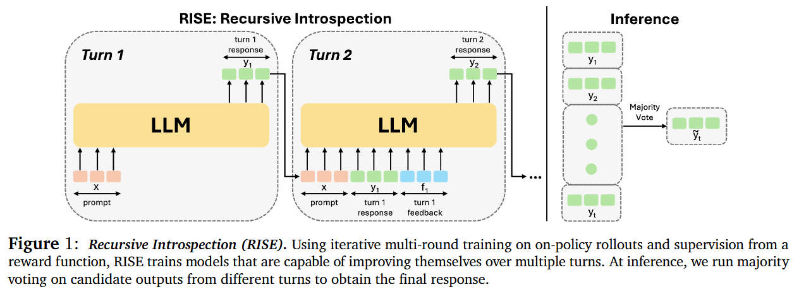

主要是针对 **Scaling LLM Test-Time Compute Optimally can be More Effective than Scaling Model Parameters** (Google DeepMind) 这篇 Paper 的一些结论总结。

## Abstract

Enabling LLMs to improve their outputs by using more test-time computation is a critical step towards building generally self-improving agents that can operate on open-ended natural language. In this paper, we study the scaling of inference-time computation in LLMs, with a focus on answering the question: **if an LLM is allowed to use a fixed but non-trivial amount of inference-time compute, how much can it improve its performance on a challenging prompt?** Answering this question has implications not only on the achievable performance of LLMs, but also on the future of LLM pretraining and how one should tradeoff inference-time and pre-training compute. Despite its importance, little research attempted to understand the scaling behaviors of various test-time inference methods. Moreover, current work largely provides negative results for a number of these strategies. **In this work, we analyze two primary mechanisms to scale test-time computation: (1) searching against dense, process-based verifier reward models; and (2) updating the model’s distribution over a response adaptively, given the prompt at test time.** We find that in both cases, the effectiveness of different approaches to **scaling test-time compute critically varies depending on the difficulty of the prompt**. **This observation motivates applying a “compute-optimal” scaling strategy, which acts to most effectively allocate test-time compute adaptively per prompt**. Using this compute-optimal strategy, we can improve the efficiency of test-time compute scaling by more than 4× compared to a best-of-N baseline. Additionally, in a FLOPs-matched evaluation, we find that on problems where a smaller base model attains somewhat non-trivial success rates, test-time compute can be used to outperform a 14× larger model.

问题：Test-time scaling；背景：评估了两种test-time scaling的方法；Motivation：两种方法的成功与否都与当前prompt对应任务的难度有关；方法：dynamic allocation of computation resource to each task.

## A Unified Perspective on Test-Time Computation: Proposer and Verifier

介绍了被评估的两种 test-time scaling的方法，也是值得我们思考是否可以被用在其他领域的。这里的 Proposer 在 LLM 的 setting 下可以认为是大语言模型自身，Verifier 可以被认为是一个外部的预训练好的或者是预定义好的 reward model。

**Modifying the proposal distribution.** One way to improve the proposal distribution is to directly optimize the model for a given reasoning task via RL-inspired finetuning methods such as STaR or ReSTEM. Note that these techniques do not utilize any additional input tokens but specifically finetune the model to induce an improved proposal distribution. Instead, techniques such as self-critique enable the model itself to improve its own proposal distribution at test time by instructing it to critique and revise its own outputs in an iterative fashion. Since prompting off-the-shelf models is not effective at enabling effective revisions at test time, we specifically finetune models to iteratively revise their answers in complex reasoning-based settings. To do so, we utilize the approach of finetuning on on-policy data with Best-of-N guided improvements to the model response.

[1] Recursive Introspection: Teaching Language Model Agents How to Self-Improve. (CMU, UCB)

这类方法在 test-time scaling 的时候可以将 inference budget 分配给 图 1 的 Inference Turn 这里。（图 2 是其训练数据的构造过程）

**Optimizing the verifier.** In our abstraction of the proposal distribution and verifier, the verifier is used to aggregate or select the best answer from the proposal distribution. The most canonical way to use such a verifier is by applying best-of-N sampling, wherein we sample N complete solutions and then select the best one according to a verifier. However, this approach can be further improved by training a process-based verifier, or a process reward model (PRM), which produces a prediction of the correctness of each intermediate step in a solution, rather than just the final answer. We can then utilize these per-step predictions to perform tree search over the space of solutions, enabling a potentially more efficient and effective way to search against a verifier, compared to naïve best-of-N.

[1] Training Verifiers to Solve Math Word Problems. (OpenAI. To increase performance, we propose training verifiers to judge the correctness of model completions. At test time, we generate many candidate solutions and select the one ranked highest by the verifier.)

[2] Let's Verify Step by Step. (OpenAI. Introducing process supervision, which provides feedback for each intermediate reasoning step.)

## Scaling Test-Time Computation Optimally

本文自己提出的方法。It tackles this problem: when using a model finetuned for revisions as the proposal distribution and an ORM (Outcome Reward Model, or Sparse Reward Model) as the verifier, we could either spend the full test-time compute budget on generating N independent samples in parallel from the model and then apply best-of-N, or we could sample N revisions in sequence using a revision model and then select the best answer in the sequence with an ORM, or strike a balance between these extremes. 也就是说，探究在这两种方法下，在有限的 inference budget 的前提下达到更好的能力。

Intuitively, we might expect “easier” problems to benefit more from revisions, since the model’s initial samples are more likely to be on the right track but may just need further refinement. On the other hand, challenging problems may require more exploration of different high-level problem solving strategies, so sampling many times independently in parallel may be preferable in this setting.

于是我们去 Estimate Question 的 Difficulty. We bin the model’s pass@1 rate—estimated from 2048 samples—on each question in the test set into five quantiles, each corresponding to increasing difficulty levels, and use the final answer score from a learned verifier (and not groundtruth answer correctness checks).

## 实验

## 其他想法的讨论

- Diffusion 生成的 Test-time Scaling 时刻？Well…Diffusion 的单次推理开销已经在一定程度上限制了在 test-time 推理的可行性（Though 很多设计师确实会生成多次然后用 best-of-N，把自己当成一个 verifier；同时 Sanja Fidler 挂名的 ICML 24 的 Paper *Align your steps* 其实做了 scheduler space 的 timestep 的搜索，somehow 和改变生成式模型的输出分布这件事很像）
- 在具身的应用？Actually 这个paper里的一些概念从 RL 里 borrow 来的，一方面是 few-shot demonstration 确实已经被证明了在训练阶段有用（虽然 in-context learning from inference stage remains to be explored, 这个还是先等 scalable 的 robotics transformer 开发出来再说吧）；另一方面是 real-world 不是一个可以 reset 的仿真环境，不太能像 LLM 的 decoding 一样搜索与回溯。