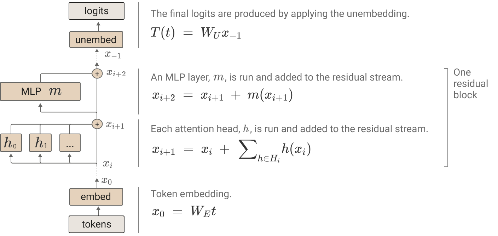

这篇文章试着分析了 Transformer 架构的可解释性。它分析了 Zero-Layer, One-Layer Attn-Only 和 Two-Layer Attn-Only 三种 Transformer 在处理文本 next token prediction 任务时，模型是怎么通过权重“学会”序列建模的。本随笔中记录了一些方法论和结论上的有趣之处。

## Transformer Overview

相比于原始 Transformer 的简化：1. Attn-Only, no MLP, 2. No Bias Term, 3. No Normalization.

关于 Transformer 架构的一些结论：

(A) The residual stream serves as a communication channel, allowing layers to interact without performing processing itself. Its deeply linear structure implies that it doesn't have a "privileged basis" and can be rotated without changing model behavior.

(B) Virtual weights directly connect any pair of layers by multiplying out their interactions through the residual stream. These virtual weights describe how later layers read information written by previous layers.

(C) Subspaces and Residual Stream Bandwidth: The residual stream is a high-dimensional vector space, allowing layers to store information in different subspaces. Dimensions of the residual stream act like "memory" or "bandwidth," with high demand due to the large number of computational dimensions relative to residual stream dimensions. Some MLP neurons and attention heads may manage memory by clearing residual stream dimensions set by other layers.

(D) Attention Heads are Independent and Additive: Attention heads operate independently and add their output back into the residual stream. This independence allows for a clearer theoretical understanding of transformer layers.

(E) Attention Heads as Information Movement:

- **Attention heads move information from one token's residual stream to another's.**
- The process involves two linear operations: the attention pattern ($A$) and the output-value matrix ($W_O W_V$).
- The attention pattern determines which token's information is moved, while the output-value matrix determines what information is read and how it is written. These two processes are independent from each other.

(F) Other Observations about Attention Heads:

- Attention heads perform a linear operation if the attention pattern is fixed.
- The matrices $W_Q$ and $W_K$ always operate together, as do $W_O$ and $W_V$.
- Keys, queries, and value vectors are intermediary by-products of computing low-rank matrices.
- Combined matrices $W_{OV} = W_O W_V$ and $W_{QK} = W_Q^T W_K$ can be defined for simplicity.
- Products of attention heads behave much like attention heads themselves. (Attention heads across different layers can be combined. We call these virtual attention.)

## Zero-Layer Transformers

在语言模型中，bigram 模型是一种简单的统计模型，它根据前一个词预测下一个词。对于零层 Transformer，由于它只能使用当前 token 的信息来预测下一个 token，因此它的行为类似于 bigram 模型。具体来说，零层 Transformer 通过 $ W_U W_E $ 直接将当前 token 的嵌入映射到预测下一个 token 的 logits，这与 bigram 模型根据前一个词预测下一个词的方式相似。

## One-Layer Attn-Only Transformer

### Formulation

1. **Effect of Source Token on Logits**:
    - If multiple destination tokens attend to the same source token with the same attention weight, the source token will influence the logits for the predicted output token in the same way for all those destination tokens.
2. **Independent Consideration of OV and QK Circuits**:
    - It can be useful to think of the OV (Output-Value) and QK (Query-Key) circuits **separately** since they are individually understandable functions (linear or bilinear operations on matrices).

### Skip-Trigrams

One-Layer Attn-Only Transformer 可以被解释为 Skip-Trigrams。

- The QK circuit determines which "source" token（提供 K） the "destination"（提供 Q） token attends to and copies information from.
- The OV circuit describes the effect on the "out" predictions for the next token.
- Together, they form a "skip-trigram" [source]... [destination] [out].

这使得 Copying and Primitive In-Context Learning 成为了可能。具体来说：

- Attention heads often dedicate capacity to copying tokens, increasing the probability of the token and similar tokens.
- Tokens are copied to plausible positions based on bigram statistics.

但是这种 Skip-Trigram 的建模方式也有问题。

我们的单层模型以“分解形式”在 OV 和 QK 矩阵之间表示 skip-trigrams。这有点像将函数 $ f(a, b, c) = f_1(a, b)f_2(a, c) $ 表示出来。它们无法灵活地捕捉三方交互。例如，如果一个注意力头增加了 `keep`...`in mind` 和 `keep`...`at bay` 的概率，它也必须增加 `keep`...`in bay` 和 `keep`...`at mind` 的概率。这里 in 或者 at 提供了 query，成功的 attend 到了 keep 这个 token 提供的 key。但是，keep 这个 token 提供的 value（mind，bay）却没有与 query 做有效的建模。这个问题会在 Two-Layer Attn-Only Transformers 中得到解决。

如何检测这种存在于 Attn Head 之中的复制行为？

To detect copying behavior in transformer models, researchers focus on identifying **matrices that** **map the same vector to itself, thus increasing the probability of a token recurring**. This involves examining the **eigenvalues and eigenvectors** of the OV circuit matrices. If a matrix has positive eigenvalues, it suggests that a linear combination of tokens increases the logits of those same tokens, indicating copying behavior. 

This method reveals that many attention heads possess positive eigenvalues, aligning with the copying structure. While positive eigenvalues are strong indicators of copying, they are not definitive proof, as some matrices with positive eigenvalues may still decrease the logits of certain tokens. Alternative methods, like analyzing the matrix diagonal, also point to copying but lack robustness. Despite its imperfections, the eigenvalue-based approach serves as a useful summary statistic for identifying copying behavior.

## Two-Layer Attn-Only Transformer

### Formulation

### **Term Importance Analysis**

我们使用上面的方法分析二层 Transformer 公式中每一项的重要性。

We conclude that for understanding two-layer attention only models, we shouldn’t prioritize understanding the second order “virtual attention heads” but instead focus on the direct path (which can only contribute to bigram statistics) and individual attention head terms.

We can further subdivide these individual attention head terms into those in layer 1 and layer 2:

This suggests we should focus on the second layer head terms.

### Induction Head

二层 Transformer 与 一层 Transformer 的最大区别在于，Q, K, V  read features in a subspace affected by a previous head.

By dividing the Frobenius norm of the product of the matrices by the Frobenius norms of the individual matrices, we obtain a normalized measure that accounts for the sizes of the matrices involved. This normalization helps to compare the relative importance of different compositions. This ratio indicates how much the product deviates from what would be expected if the matrices were random, providing insight into the significance of the interaction.

我们看出 K-Composition Term 里有很显著的 pair，我们接下来详细分析这些“induction head”：

以第四行为例，这里 D 作为 query，响应最大的 key 是 urs。这说明，这两层的 attention 协同交互起到了一个作用，即将前一个 token 的 信息映射到第二个 token 的 key 中，使得：

然后，有进一步的实验来验证这个结论。 Given that we believe **induction heads are attending to previous copies of the token and shifting forward**, they should be able to do this on ***totally random*** repeated patterns. This is likely the hardest test one can give them, since they can't rely on normal statistics about which tokens typically come after other tokens. 

这两张图展示了 attention to <5767> 的 token。

**怎么找出 induction heads?** Our mechanistic theory suggestions that induction heads must do two things:

- Have a "copying" OV circuit matrix (in previous layer).
- Have a "same matching" QK circuit matrix. (As the previous layer has transported information of the previous token into current hidden state.)

