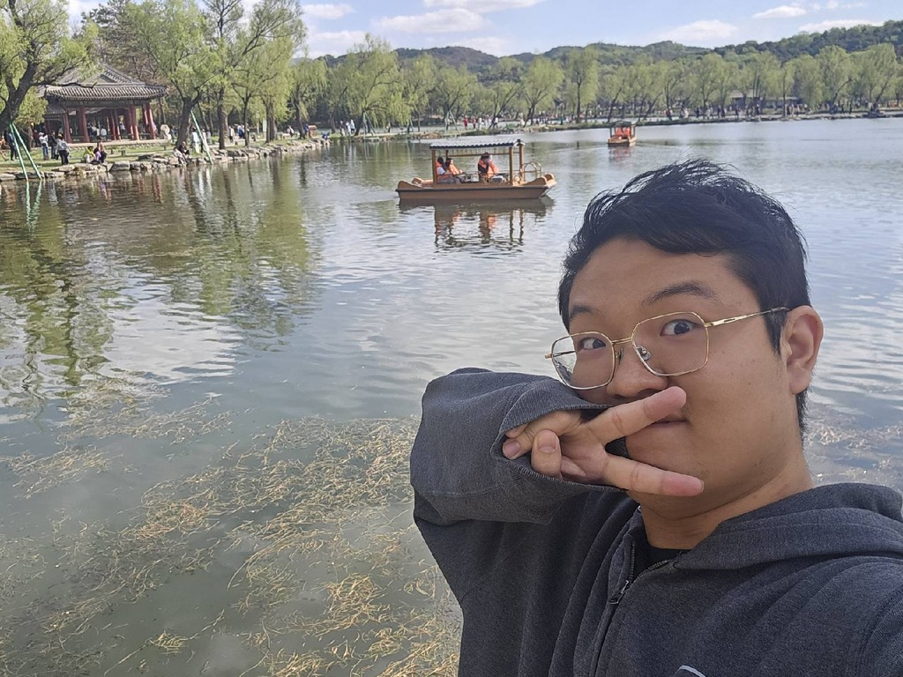

- First-year Ph. D. student @ CS & AIR, Tsinghua University
- Co-founder @ [Lumina-Embodied.AI](https://lumina-embodied.ai) Community

### Education

  

    

    

      <h3>Bachelor of Engineering</h3>
      
2020 - 2024 | Computer Science | Tsinghua University

      
<strong>GPA 3.98 / 4.00.</strong> Ranked <strong>#1</strong> out of 204 in the Department of CS.

      
Proud to have received the highest distinction for undergraduates at <a href="https://air.tsinghua.edu.cn/info/1007/2133.htm">Tsinghua</a>.

    

  

  
  
  

    

    

      <h3>Ph.D. Student</h3>
      
2024 - Present | Computer Science | Tsinghua University

      
 Advisor: Prof. <a href="https://air.tsinghua.edu.cn/en/info/1046/1188.htm">Ya-Qin Zhang</a>, Dean of Institute for AI Industry Research (AIR), THU.

    

  

### Research Interests

Let's build the agents that transition humanity from *hands-off* interaction to a *minds-off* future! 
Most recently, I am working with [SIALab](https://air.tsinghua.edu.cn/en/info/1007/1886.htm) on building agents that set our mind free for daily tasks. 
Topics I am interested in:
- Multi-turn Reinforcement Learning
- Scalable Reinforcement Learning
- Evaluation of Capability Bottleneck in Agent Systems
- Self-evolution of Agent Systems

### Research Experience

Generative Simulation for Embodied AI

  

    

    

      <h3>Problem Identification</h3>
      
The development and iteration of autonomous driving and robotics policies are limited by the high costs, low efficiency, and safety risks of real-world testing. The rise of Generative AI offers a potential breakthrough by enabling high-fidelity, interactive, and editable simulation testing.

    

  

  
  

    

    

      <h3>Technical Approach</h3>
      
My research focused on building "World Models" to drive simulation with generative methods. Technically, I explored two core directions: 1) <strong>High-fidelity Scene Reconstruction:</strong> Building "digital twins" of real scenes using technologies like NeRF or Gaussian splatting. 2) <strong>Controllable Content Generation:</strong> On the basis of reconstructed scenes, leveraging the generative priors of diffusion models to provide endless, controllable scene variations and edge cases.

    

  

  
  

    

    

      <h3>Selected Publications</h3>
      
† indicates first or co-first author.

      <ul>
        <li>†PartRM: Modeling Part-Level Dynamics with <strong>Large</strong> Cross-State <strong>Reconstruction Model</strong>, <em>CVPR 2025</em>.</li>
        <li>†Ctrl-U: Robust <strong>Conditional Image Generation</strong> Via Uncertainty-aware Reward Modeling, <em>ICLR 2025</em>.</li>
        <li>†SCP-Diff: Spatial-Categorical Joint Prior for <strong>Diffusion</strong> Based Semantic Image Synthesis, <em>ECCV 2024</em>.</li>
      </ul>
    

  

Data Efficient Scene Parsing

  

    

    

      <h3>Problem Identification</h3>
      
2D/3D perception is fundamental to embodied intelligence, but the extremely high cost of data annotation severely restricts the development of perception models.

    

  

  
  

    

    

      <h3>Technical Approach</h3>
      
My early research focused on data-efficient perception learning algorithms, particularly <strong>semi-supervised learning</strong> and <strong>domain adaptation</strong>. In my first ICCV paper, DQS3D, I proposed a single-stage, densely-matched semi-supervised learning framework for 3D object detection, addressing the issue of insufficient training signals caused by sparse matching in previous methods. I also explored various levels of perception tasks such as self-supervised depth estimation, indoor layout estimation, and HD map generation, mastering task-oriented <strong>neural network and representation design methods</strong>.

    

  

  
  

    

    

      <h3>Publications</h3>
      
† indicates first or co-first author.

      <ul>
        <li>†DQS3D: Densely-matched Quantization-aware <strong>Semi-supervised</strong> 3D Detection, <em>ICCV 2023</em>.</li>
        <li>†From <strong>Semi-supervised</strong> to Omni-supervised Room Layout Estimation Using Point Clouds, <em>ICRA 2023</em>.</li>
        <li>†Training-Free <strong>Model Merging</strong> for Multi-target <strong>Domain Adaptation</strong>, <em>ECCV 2024</em>.</li>
      </ul>
    

  

### Services

<strong>Co-Founder</strong> @ <a href="https://lumina-embodied.ai">Lumina-Embodied.AI</a> (2025.4-Now)

- Building community for embodied AI research and applications
- Bridging academic research with industry implementations
- Focus on AI systems that learn through physical interaction

<strong>Reviewer</strong> @ Academic Conferences & Journals

- CVPR (2025), ICCV (2025), WACV (2024), 3DV (2025), TPAMI
- NeurIPS (2025), ICLR (2025)
- ICRA (2025), IROS (2024, 2025), CoRL (2025)
- AAAI (2024), ICME (2025)

Teaching Assistant @ CS, THU

- (30240163) Software Engineering. Compulsory course in CS, THU. (23Spring, 23Fall, 24Spring, 24Fall, 25Spring, **25Fall**)
- (30240551) Digital Logic Experimentation. Compulsory course in CS, THU. (24Spring, 25Spring)
- (40240354) Computer Organization and Design. Compulsory course in CS, THU. (23Fall)

清华大学计算机系 科创辅导员 (2024.9-Now)

- Technical training & competition guidance for undergraduates
- Research & internship opportunity integration

清华大学计算机系 学生科协主席 (2023.5-2024.6)

- Built [homepage](https://net9.org/) & [documentation](https://docs.net9.org/)
- Organized [summer training camp](https://www.bilibili.com/video/BV1YmxMePE7x) for freshmen
- Launched [resource portal](https://stu.cs.tsinghua.edu.cn/resources/) for students

